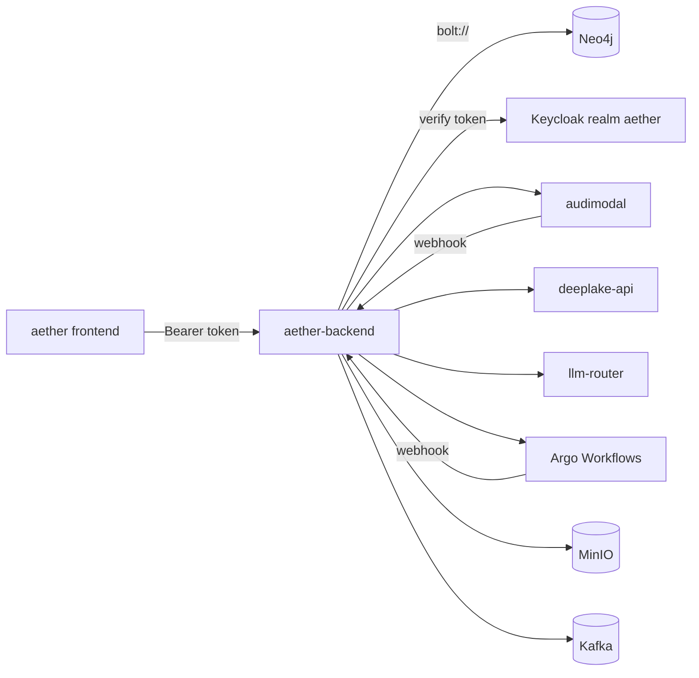

# Aether Backend (`aether-be`)

[-blue.svg)](https://golang.org)
[](LICENSE)
[](https://aether-api.tas.scharber.com/health)

The HTTP API behind the Aether web application. It is a single Go binary that
owns Aether's knowledge graph in Neo4j and coordinates the other Tributary AI
Services (TAS) services that do the heavy lifting around it.

## What this is

Aether lets a person collect documents into notebooks, ask questions of them,
and produce things from them — summaries, reports, podcasts. This repository is
the server that makes that possible. It holds the authoritative record of who
owns what: users, spaces, teams, organizations, notebooks, documents,
conversations, comments, agents, workflows, and the artifacts ("productions")
those workflows emit. All of it lives as nodes and relationships in Neo4j, and
every read or write from the frontend goes through this service.

It is deliberately not the thing that does the expensive work. File bytes go to
S3-compatible storage; document parsing, extraction, and chunking go to
AudiModal; embeddings and vector search go to the DeepLake API; model calls go
to the LLM Router; multi-step orchestration goes to Argo Workflows. This service
holds the graph, enforces access, and calls out. If you are looking for the code
that extracts text from a scanned PDF or that picks which model answers a
prompt, it is in `audimodal` or `tas-llm-router`, not here.

The React frontend that consumes this API lives in the sibling `aether`
repository.

## Status & scope

**As of 2026-08-26, this is deployed and carrying traffic.** It is not an early
prototype, which is what this section said until this refresh — that claim was
eight months stale.

```
$ kubectl get deploy aether-backend -n aether-be -o custom-columns=NAME:.metadata.name,READY:.status.readyReplicas,IMAGE:.spec.template.spec.containers[0].image
NAME             READY   IMAGE
aether-backend   2       registry-api.tas.scharber.com/aether-backend:dup-agent-fix-20260619
```

Two replicas in namespace `aether-be`, created 253 days ago, reachable at
`https://aether-api.tas.scharber.com`. It registers 246 handlers across 34 route
groups under `/api/v1` (`internal/handlers/routes.go:333`), and `/health` on the
live deployment reports its three checked dependencies as healthy:

```bash
curl -sS -k https://aether-api.tas.scharber.com/health
{"status":"ready","timestamp":"2026-08-26T23:07:24.367597544Z","services":{"kafka":{"status":"healthy","response_time_ms":755632},"neo4j":{"status":"healthy","response_time_ms":1052754},"storage":{"status":"healthy","response_time_ms":604131}}}
```

What is genuinely unfinished, verified against the code at `ded9a3d`:

- **`APIServer.Shutdown()` does nothing.** It logs and returns nil
  (`internal/handlers/routes.go:905`). The HTTP server itself does drain — `main`
  gives outstanding requests 30 seconds (`cmd/server/main.go:215`) — but external
  connections are closed by process exit, not by the shutdown path.
- **The `/api/v1/admin` group registers no routes.** The group and its
  `RequireRole("admin")` middleware exist; the handlers behind it were never
  written (`internal/handlers/routes.go:879`).
- **Most service-layer unit tests are excluded from the build.** Seven files
  under `internal/services/` carry `//go:build ignore`, so `go test` reports
  `[no tests to run]` for that package. Real coverage is `internal/validation`
  and `pkg/errors`.
- **Argo Workflows submission is wired but cold.** The generator targets
  namespace `argo` with service account `argo-workflow-runner`
  (`internal/services/argo_generator.go:37`), `ARGO_WORKFLOWS_ENABLED` is `"true"`
  in the production ConfigMap, and the Argo custom resource definitions are
  installed on the cluster — but the newest `Workflow` objects in that namespace
  are roughly 187 days old, so this path has not run recently.
- **`ROADMAP.md` is stale and should not be read as status.** Its Phase 1
  checkboxes ("Go project structure", "Neo4j database setup", "Redis
  integration") are still unticked against software that has been serving
  requests for eight months.

Scheduled CI on `main` is green: the most recent Security Scanning and
Performance Testing runs both succeeded on 2026-08-26.

### Build and test

`make build` is clean at `ded9a3d`:

```bash
make build
Building application...
go build -o bin/aether-backend cmd/server/main.go
```

`make test-unit` is the target that passes with nothing else running:

```bash
make test-unit
Running unit tests...
PASS
ok  	github.com/Tributary-ai-services/aether-be/internal/validation	(cached)
PASS
ok  	github.com/Tributary-ai-services/aether-be/pkg/errors	(cached)
```

**`make test` fails on a clean checkout, and that is expected rather than a
regression.** It runs `go test -v ./...` (`Makefile:28`), which sweeps in
`tests/integration/`, and those tests probe live dependencies before asserting
anything:

```bash
make test
--- FAIL: TestAPIFormatCompatibility (30.05s)
--- FAIL: TestComplianceIntegration (30.05s)
--- FAIL: TestDocumentProcessingPipeline (30.05s)
--- FAIL: TestEmbeddingIntegration (30.04s)
--- FAIL: TestStorageIntegration (30.05s)
FAIL	github.com/Tributary-ai-services/aether-be/tests/integration	150.476s
make: *** [Makefile:28: test] Error 1
```

Each of the five aborts in its suite setup
(`tests/integration/api_format_test.go:24` and its siblings) with
`Service at http://localhost:8084/__admin/health not available after 30s`. They
need the stack in `docker-compose.test.yml` — a WireMock AudiModal stub on
`:8084`, a DeepLake stub, Redis, MinIO, and Keycloak. Bringing up only this
service on `:8080` moves the failure from the backend probe to the `:8084`
probe; it does not make them pass. Everything outside `tests/integration` passed
in the same run.

## Quick start

Neo4j is a hard dependency. Start it first, or the process exits before it binds
a port.

```bash
docker run -d --name aether-neo4j -p 7687:7687 -e NEO4J_AUTH=neo4j/password neo4j:5.15-community
make build
NEO4J_URI=bolt://localhost:7687 NEO4J_PASSWORD=password NEO4J_DATABASE=neo4j \
  KEYCLOAK_ENABLED=false PORT=8099 ./bin/aether-backend
{"level":"info","msg":"Starting Aether Backend Server","version":"0.1.0","environment":"development","port":"8099"}
{"level":"warn","msg":"Keycloak disabled (KEYCLOAK_ENABLED=false) - authentication will NOT be enforced"}
{"level":"info","msg":"Storage service disabled in configuration"}
{"level":"info","msg":"PostgreSQL disabled - security events will only be logged to stdout/Kafka"}
{"level":"info","msg":"Starting HTTP server","address":":8099"}
```

Confirm it is serving:

```bash
curl -sS http://localhost:8099/health
{"status":"ready","timestamp":"2026-08-26T23:10:13.264390609Z","services":{"neo4j":{"status":"healthy","response_time_ms":179061679}}}
```

`response_time_ms` is a `time.Duration` serialized under a millisecond-suffixed
name (`internal/handlers/health.go:50`), so the figure above is 179 million
nanoseconds — 179ms. Read it as nanoseconds until that field is fixed.

### What `KEYCLOAK_ENABLED=false` buys you, and what it does not

The auth middleware short-circuits when the Keycloak client is nil
(`internal/middleware/auth.go:21`), but the handlers behind it still read a
`user_id` out of the request context that nothing put there. So user-scoped
routes stay closed even with authentication disabled:

```bash
curl -sS -w '\nHTTP %{http_code}\n' http://localhost:8099/api/v1/users/me
{"code":"UNAUTHORIZED","message":"User not authenticated"}
HTTP 401
```

Routes that carry no user context do work, which makes them the useful local
smoke test. The frontend log-ingest endpoint is one:

```bash
curl -sS -X POST http://localhost:8099/api/v1/logs -H 'Content-Type: application/json' \
  -d '{"logs":[{"level":"info","message":"readme verification probe","timestamp":"2026-08-26T23:10:00Z","url":"http://localhost:8099/","session_id":"readme-check-1"}]}'
{"count":1,"message":"Logs received","status":"success"}
```

It re-emits each entry as a structured line on stdout, tagged `source: frontend`,
which is how browser logs reach Loki:

```
{"level":"info","msg":"readme verification probe","source":"frontend","client_url":"http://localhost:8099/","session_id":"readme-check-1","timestamp_client":"2026-08-26T23:10:00.000Z"}
```

For real user-scoped work locally, leave Keycloak enabled and point
`KEYCLOAK_URL` at a running server.

### The first failure you will hit

Starting without Neo4j reachable is fatal, and it happens before anything else
is initialised:

```
{"level":"info","msg":"Initializing database connections"}
{"level":"fatal","msg":"Failed to initialize Neo4j client","error":"failed to verify Neo4j connectivity: ConnectivityError: dial tcp 127.0.0.1:7687: connect: connection refused"}
```

The second most likely is the database *name*. The code default for
`NEO4J_DATABASE` is `aether` (`internal/config/config.go:315`), but a stock Neo4j
Community instance only has `neo4j`, and that is what both the production
ConfigMap and `docker-compose.yml` set. Passing `NEO4J_DATABASE=neo4j` as above
avoids it; commit `00b503d` fixed the same trap in CI.

A missing `NEO4J_PASSWORD` fails earlier still, in config validation
(`internal/config/config.go:570`), with `NEO4J_PASSWORD is required`.

### Calling the deployed API

Unauthenticated requests to `/api/v1/**` are rejected by the middleware:

```bash
curl -sS -k -w '\nHTTP %{http_code}\n' https://aether-api.tas.scharber.com/api/v1/users/me
{"code":"UNAUTHORIZED","message":"Authorization token is required"}
HTTP 401
```

Authentication is an OpenID Connect (OIDC) token from the `aether` realm on
Keycloak. The verifier sets `SkipClientIDCheck: true`
(`internal/auth/keycloak.go:85`) and instead matches the issuer against an
allow-list, so a token minted by the public `aether-frontend` client is accepted
by the backend. The realm's token endpoint is
`https://keycloak.tas.scharber.com/realms/aether/protocol/openid-connect/token`,
confirmed from its discovery document.

> [!UNVERIFIED] The end-to-end token exchange below could not be completed. The
> credentials in the `aether-frontend-dev-credentials` secret (namespace
> `aether-be`, keys `VITE_DEV_USERNAME` / `VITE_DEV_PASSWORD`) are rejected by
> Keycloak with `invalid_grant: Invalid user credentials`, and the
> `KEYCLOAK_CLIENT_SECRET` in `aether-backend-secret` is rejected as
> `unauthorized_client`. Both appear to have drifted from the realm. The token
> endpoint, the realm, and the `aether-frontend` client's direct-access grant
> were each verified; only the credential values were not. Obtain working
> credentials from the realm owner before relying on this step.

```bash
# Substitute credentials that the aether realm actually accepts.
AETHER_TOKEN=$(curl -sS -k -X POST \
  'https://keycloak.tas.scharber.com/realms/aether/protocol/openid-connect/token' \
  -d grant_type=password -d client_id=aether-frontend -d scope=openid \
  -d "username=$KC_USER" -d "password=$KC_PASS" | jq -r .id_token)
curl -sS -k https://aether-api.tas.scharber.com/api/v1/users/me \
  -H "Authorization: Bearer $AETHER_TOKEN"
```

Server-sent-event routes accept the same token as a `?token=` query parameter,
because `EventSource` cannot set headers (`internal/middleware/auth.go:41`).

## How it fits

Neo4j is the only dependency whose absence stops the process. Everything else
degrades: the service logs a warning and disables the feature that needed it.
That asymmetry is the thing worth remembering at 2am.

| Dependency | Where it runs | If it is down |
|---|---|---|
| Neo4j | `neo4j-0`, namespace `aether-be`, plain `bolt://` on 7687 | Process exits at startup (`cmd/server/main.go:60`) |
| Keycloak | `keycloak-shared`, namespace `tas-shared`, realm `aether` | Fatal at startup while `KEYCLOAK_ENABLED` is true (`cmd/server/main.go:74`) |
| MinIO (S3) | `minio-shared`, namespace `tas-shared` | Boots; file operations disabled (`cmd/server/main.go:85`) |
| Kafka | `kafka-shared`, namespace `tas-shared` | Boots; events dropped, podcast progress stops updating |
| PostgreSQL / TimescaleDB | `timescaledb-shared`, namespace `tas-shared` | Boots; security events go to stdout and Kafka only |
| Redis | `redis-shared`, namespace `tas-shared` | Boots; podcast progress tracking disabled (`internal/handlers/routes.go:191`) |
| AudiModal | `audimodal`, same namespace | Boots; document processing calls fail per request |
| DeepLake API | `deeplake-api`, same namespace | Boots; vector search calls fail per request |
| LLM Router | `llm-router`, namespace `tas-llm-router` | Boots; `/api/v1/router/*` returns `502 EXTERNAL_SERVICE_ERROR` |
| Argo Workflows | namespace `argo` | Boots; workflow execution submission fails |

Note that Bolt TLS is disabled on this cluster, so connections use plain
`bolt://` rather than `neo4j+s://` — commit `9fbf17b` made that change and added
the Bolt ingress used by browsers.



Two callbacks come back in: AudiModal posts to
`/webhooks/audimodal/processing-complete` when a document finishes processing,
and workflow completion posts to `/webhooks/workflow-complete`. Both are
registered without authentication (`internal/handlers/routes.go:340`).

## Configuration

Configuration is environment variables only, loaded in `internal/config/config.go`.
The settings below are the ones that change behaviour; several have code
defaults that differ from what production runs, and the gap has bitten people.

| Variable | Code default | Production value | What it changes |
|---|---|---|---|
| `NEO4J_URI` | `bolt://localhost:7687` | `bolt://neo4j.aether-be.svc.cluster.local:7687` | Graph endpoint. Plain Bolt — TLS is off on this cluster. |
| `NEO4J_DATABASE` | `aether` | `neo4j` | **Differs.** The default names a database a stock Neo4j does not have. |
| `KEYCLOAK_ENABLED` | `true` | unset (so `true`) | `false` skips token verification entirely and leaves user-scoped routes returning 401. |
| `KEYCLOAK_REALM` | `aether` | `aether` | Realm whose issuer must appear in the allow-list. |
| `STORAGE_ENABLED` | `false` | `true` | **Differs.** Off by default, so local runs have no file storage unless you opt in. |
| `KAFKA_ENABLED` | `false` | `true` | **Differs.** Off by default; event publishing and podcast progress need it. |
| `POSTGRES_ENABLED` | `false` | `true` | **Differs.** Off by default; security-event persistence needs it. |
| `ROUTER_ENABLED` | — | `true` | Mounts the `/api/v1/router/*` proxy. When true, three router settings become mandatory (`internal/config/config.go:586`). |
| `ARGO_WORKFLOWS_ENABLED` | `true` unless literally `"false"` | `true` | Whether workflow execution submits Argo `Workflow` objects. |
| `LOG_LEVEL` / `LOG_FORMAT` | `info` / `json` | `debug` / `json` | Production runs at debug, which is a meaningful volume difference in Loki. |

The listener port is 8080 in code and 8080 in the deployment. `.env.example`
still lists 8081, which has never been either value — the file has drifted, and
the quick start above overrides the port explicitly to keep out of the way of
anything else you have listening.

Non-secret production values live in ConfigMap `aether-backend-config`,
namespace `aether-be`. Secrets live in secret `aether-backend-secret`, same
namespace, which holds 19 keys including `NEO4J_PASSWORD`,
`KEYCLOAK_CLIENT_SECRET`, `AWS_SECRET_ACCESS_KEY`, `OAUTH_ENCRYPTION_KEY`, and
`ROUTER_API_KEY`. Read them from the cluster when you need them; none of their
values belong in this file, in a shell history, or in a screenshot.

Config validation runs at startup (`internal/config/config.go:569`) and refuses
to boot on a missing `NEO4J_PASSWORD`, a missing `KEYCLOAK_CLIENT_SECRET` while
Keycloak is enabled and a Keycloak URL is set, missing storage credentials while
`STORAGE_ENABLED=true`, an empty broker list while Kafka is on, and any of the
three router settings while `ROUTER_ENABLED=true`.

Kubernetes manifests are in `k8s/` (the applied set) and `deployments/` (base
plus dev, staging, testing, and production Kustomize overlays).

## Where to go next

- [`API_DOCUMENTATION.md`](API_DOCUMENTATION.md) — endpoint-by-endpoint request
  and response shapes, including the LLM Router proxy tiers.
- [`DEVELOPER.md`](DEVELOPER.md) — environment setup, coding standards, and the
  contribution workflow.
- [`docs/BACKEND-DESIGN.md`](docs/BACKEND-DESIGN.md) — the graph schema and the
  architecture this service was built to.
- [`docs/TESTING_README.md`](docs/TESTING_README.md) and
  [`docs/TEST_PLAN.md`](docs/TEST_PLAN.md) — what the test suites cover and how
  to bring up the dependencies `make test` expects.
- [`k8s/NEO4J-SETUP.md`](k8s/NEO4J-SETUP.md) — cluster Neo4j configuration,
  including why Bolt TLS is off.
- Cross-service data models, including the identifier chain from Keycloak
  through this service to AudiModal and DeepLake, live in the monorepo at
  `aether-shared/data-models/`.
- Logs: Grafana Explore against the Loki data source, query
  `{namespace="aether-be", container="aether-backend"}`. Frontend-originated
  entries carry `source="frontend"`.
- Metrics: `/metrics/prometheus` on the service exports 47 metric families
  (`http_requests_total`, `http_request_duration_seconds`, and Neo4j, Redis, and
  business gauges). Plain `/metrics` returns a pointer to it, not metrics.
- Issues: <https://github.com/Tributary-ai-services/aether-be/issues>

Licensed under the Apache License 2.0 — see [`LICENSE`](LICENSE).
