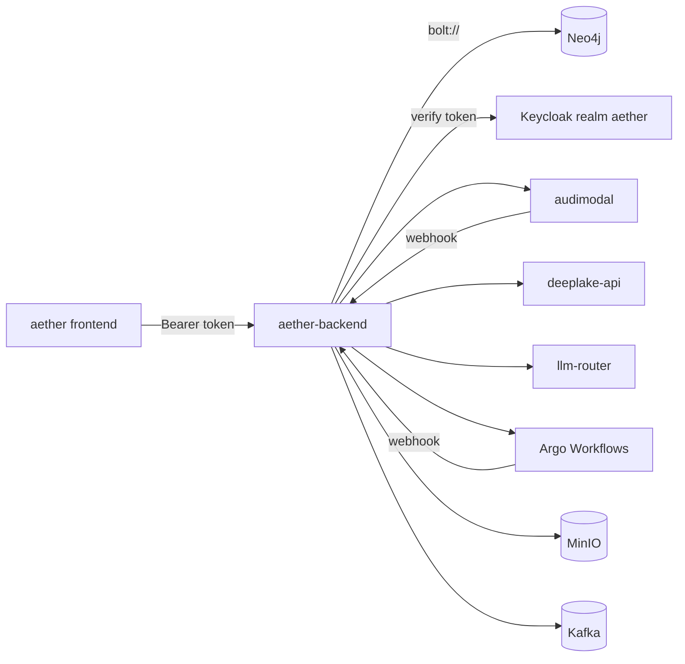

# Aether Backend (`aether-be`)

[-blue.svg)](https://golang.org)
[](LICENSE)
[](https://aether-api.tas.scharber.com/health)

The HTTP API behind the Aether web application. It is a single Go binary that
owns Aether's knowledge graph in Neo4j and coordinates the other Tributary AI
Services (TAS) services that do the heavy lifting around it.

## What this is

Aether lets a person collect documents into notebooks, ask questions of them,
and produce things from them — summaries, reports, podcasts. This repository is
the server that makes that possible. It holds the authoritative record of who
owns what: users, spaces, teams, organizations, notebooks, documents,
conversations, comments, agents, workflows, and the artifacts ("productions")
those workflows emit. All of it lives as nodes and relationships in Neo4j, and
every read or write from the frontend goes through this service.

It is deliberately not the thing that does the expensive work. File bytes go to
S3-compatible storage; document parsing, extraction, and chunking go to
AudiModal; embeddings and vector search go to the DeepLake API; model calls go
to the LLM Router; multi-step orchestration goes to Argo Workflows. This service
holds the graph, enforces access, and calls out. If you are looking for the code
that extracts text from a scanned PDF or that picks which model answers a
prompt, it is in `audimodal` or `tas-llm-router`, not here.

The React frontend that consumes this API lives in the sibling `aether`
repository.

## Status & scope

**As of 2026-09-24, this is deployed and carrying traffic.** It is not an early
prototype, which is what this section said until the 2026-08-26 refresh — that
claim was eight months stale.

```
$ kubectl get deploy aether-backend -n aether-be -o custom-columns=NAME:.metadata.name,READY:.status.readyReplicas,IMAGE:.spec.template.spec.containers[0].image
NAME             READY   IMAGE
aether-backend   2       ghcr.io/tributary-ai-services/aether-be:main-ecd031b
```

Two replicas in namespace `aether-be`, created 2025-12-16, reachable at
`https://aether-api.tas.scharber.com`. The running image is the CI-built
`ghcr.io` image of this exact commit. That is ahead of the manifest in the
repository: `k8s/deployment.yaml:43` at `ecd031b` still pins the hand-built
`registry-api.tas.scharber.com/aether-backend:ops39-health-20260923`, and the
switch to the `ghcr.io` image lives on the unmerged OPS-42 branch (OPS-, SEC-
numbers here are TAS backlog tickets). Until that
merges, `kubectl apply -k k8s/` rolls production back to the older tag.

It registers 247 handlers across 34 route groups under `/api/v1`
(`internal/handlers/routes.go:333`). The deployment's probes now split liveness
from readiness (`k8s/deployment.yaml:63`, `k8s/deployment.yaml:71`), and on the
live service both report healthy. Every call to the deployed hostname in this
file passes `-k` because the ingress certificate is issued by the private
certificate authority (CA) `TAS Root CA`, which is not in a stock trust store; without it curl fails with
`SSL certificate problem: unable to get local issuer certificate`. If you have
installed that CA locally, drop `-k`.

```bash
curl -sS -k https://aether-api.tas.scharber.com/health/live
{"status":"alive","timestamp":"2026-09-24T18:21:47.708913201Z"}
curl -sS -k https://aether-api.tas.scharber.com/health/ready
{"status":"ready","timestamp":"2026-09-24T18:21:47.850434982Z","services":{"kafka":{"status":"healthy","response_time_ms":807243},"neo4j":{"status":"healthy","response_time_ms":925202},"storage":{"status":"healthy","response_time_ms":664557}}}
```

The split is the OPS-39 fix (commit `5a928ee`). Before it, both probes pointed
at `/health`, which failed whenever Kafka or storage did, so a Kafka blip
restarted every replica and pulled them all out of the Service at once. Now
`/health/live` returns 200 unconditionally (`internal/handlers/health.go:81`),
and `/health/ready` — which plain `/health` delegates to
(`internal/handlers/health.go:168`) — returns 503 only when Neo4j is
unreachable. An unhealthy Kafka or storage produces `"status":"degraded"` with
HTTP 200 (`internal/handlers/health.go:97`), so traffic keeps flowing and the
broken dependency is still named in the body. The Docker `HEALTHCHECK` targets
`/health/live` for the same reason (`Dockerfile:51`).

The single-node k3s cluster (node `um773dev`) gained a second node,
`pinova01`, on 2026-09-21, and the
Deployment asks the scheduler to spread replicas across nodes with a soft
`topologySpreadConstraints` (`k8s/deployment.yaml:33`). It is soft on purpose:
with two nodes a hard constraint would leave a replica Pending whenever one node
is down. The cost is that a rollout can co-locate both replicas, and on
2026-09-24 both pods were on `um773dev` — so the service currently survives a
pod restart but not the loss of that node. Deleting one pod rebalances them.

What is genuinely unfinished, verified against the code at `ecd031b`:

- **`APIServer.Shutdown()` does nothing.** It logs and returns nil
  (`internal/handlers/routes.go:908`). The HTTP server itself does drain — `main`
  gives outstanding requests 30 seconds (`cmd/server/main.go:278`) — but external
  connections are closed by process exit, not by the shutdown path.
- **The `/api/v1/admin` group registers no routes.** The group and its
  `RequireRole("admin")` middleware exist; the handlers behind it were never
  written (`internal/handlers/routes.go:882`).
- **Most service-layer unit tests are still excluded from the build.** Seven
  files under `internal/services/` carry `//go:build ignore`. The package now
  does run tests — the source resolution for DBHub (the SQL-console Model Context Protocol (MCP) server
  in `tas-mcp-servers` that Aether proxies database queries through) and the
  Kafka degraded-start
  tests landed with it — but the older service tests remain switched off.
  Unit coverage beyond `internal/validation` and `pkg/errors` is narrow: the
  readiness policy and liveness contract (`internal/handlers`), config
  validation (`internal/config`), Kafka and DBHub behaviour
  (`internal/services`), and the streaming hub (`internal/streaming`).
- **Argo Workflows submission is wired but cold.** The generator targets
  namespace `argo` with service account `argo-workflow-runner`
  (`internal/services/argo_generator.go:37`), `ARGO_WORKFLOWS_ENABLED` is `"true"`
  in the production ConfigMap, and the Argo custom resource definitions are
  installed on the cluster — but the newest `Workflow` object in that namespace
  was created on 2026-02-20, roughly 216 days before this check, so this path
  has not run recently.
- **`ROADMAP.md` is stale and should not be read as status.** Its Phase 1
  checkboxes ("Go project structure", "Neo4j database setup", "Redis
  integration") are still unticked against software that has been serving
  requests for eight months.

CI on `main` is green: the Tests, CI/CD Pipeline, Performance Testing, and
Progressive Testing workflows all succeeded on the push of `ecd031b`
(2026-09-24), as did the scheduled Security Scanning run that morning.

### Build and test

`make build` is clean at `ecd031b`:

```bash
make build
Building application...
go build -o bin/aether-backend cmd/server/main.go
```

`make test-unit` is the target that passes with nothing else running:

```bash
make test-unit
Running unit tests...
PASS
ok  	github.com/Tributary-ai-services/aether-be/internal/validation	(cached)
PASS
ok  	github.com/Tributary-ai-services/aether-be/pkg/errors	0.009s
```

`make test-unit` only covers those two packages (`Makefile:270`). The newer
unit tests need `go test` pointed at their packages, and they also pass with
nothing running:

```bash
go test ./internal/config ./internal/handlers ./internal/services ./internal/streaming
ok  	github.com/Tributary-ai-services/aether-be/internal/config	0.006s
ok  	github.com/Tributary-ai-services/aether-be/internal/handlers	0.079s
ok  	github.com/Tributary-ai-services/aether-be/internal/services	0.132s
ok  	github.com/Tributary-ai-services/aether-be/internal/streaming	0.051s
```

**`make test` fails on a clean checkout, and that is expected rather than a
regression.** It runs `go test -v ./...` (`Makefile:28`), which sweeps in
`tests/integration/`, and those tests probe live dependencies before asserting
anything:

```bash
go test ./...
--- FAIL: TestAPIFormatCompatibility (30.04s)
--- FAIL: TestComplianceIntegration (30.03s)
--- FAIL: TestDocumentProcessingPipeline (30.02s)
--- FAIL: TestEmbeddingIntegration (30.04s)
--- FAIL: TestStorageIntegration (30.04s)
FAIL	github.com/Tributary-ai-services/aether-be/tests/integration	150.348s
```

Each of the five aborts in its suite setup
(`tests/integration/api_format_test.go:24` and its siblings). With nothing
listening, the first probe to fail is the backend itself:
`Service at http://localhost:8080/health not available after 30s`. They need
the stack in `docker-compose.test.yml` — a WireMock (HTTP stub server) AudiModal stub on `:8084`,
a DeepLake stub, Redis, MinIO, and Keycloak. Bringing up only this service on
`:8080` moves the failure to the `:8084` probe
(`Service at http://localhost:8084/__admin/health not available after 30s`,
observed in the 2026-08-26 run); it does not make them pass. In the 2026-09-24
`go test ./...` run every package outside `tests/integration` passed, including
`tests/progressive` (unit tests for the canary / A/B rollout helpers described
in `docs/PROGRESSIVE_TESTING.md`).

## Quick start

Neo4j is a hard dependency. Start it first, or the process exits before it binds
a port.

```bash
docker run -d --name aether-neo4j -p 7687:7687 -e NEO4J_AUTH=neo4j/password neo4j:5.15-community
make build
NEO4J_URI=bolt://localhost:7687 NEO4J_PASSWORD=password NEO4J_DATABASE=neo4j \
  KEYCLOAK_ENABLED=false PORT=8099 ./bin/aether-backend
{"level":"info","msg":"Starting Aether Backend Server","version":"0.1.0","environment":"development","port":"8099"}
{"level":"warn","msg":"Keycloak disabled (KEYCLOAK_ENABLED=false) - authentication will NOT be enforced"}
{"level":"info","msg":"Storage service disabled in configuration"}
{"level":"info","msg":"PostgreSQL disabled - security events will only be logged to stdout/Kafka"}
{"level":"info","msg":"Kafka disabled — Live Streams will use legacy Neo4j polling"}
{"level":"info","msg":"TIMESCALE_DSN unset — /streams/stats will return unavailable"}
{"level":"info","msg":"Starting HTTP server","address":":8099"}
```

Confirm it is serving (re-run on 2026-09-24 against `ecd031b`):

```bash
curl -sS http://localhost:8099/health
{"status":"ready","timestamp":"2026-09-24T18:27:17.66014593Z","services":{"neo4j":{"status":"healthy","response_time_ms":99908315}}}
curl -sS http://localhost:8099/health/live
{"status":"alive","timestamp":"2026-09-24T18:27:17.811765774Z"}
```

`response_time_ms` is a `time.Duration` serialized under a millisecond-suffixed
name (`internal/handlers/health.go:63`), so the figure above is 99.9 million
nanoseconds — about 100ms. Read it as nanoseconds until that field is fixed.

To see the degraded readiness state for yourself, point Kafka at a port where
nothing listens. The process still starts, logs
`Kafka unreachable at startup - continuing in degraded mode, retrying in background`,
and reports the broken dependency without failing readiness:

```bash
NEO4J_URI=bolt://localhost:7687 NEO4J_PASSWORD=password NEO4J_DATABASE=neo4j \
  KEYCLOAK_ENABLED=false PORT=8098 KAFKA_ENABLED=true KAFKA_BROKERS=localhost:19092 ./bin/aether-backend &
curl -sS -w '\nHTTP %{http_code}\n' http://localhost:8098/health
{"status":"degraded","timestamp":"2026-09-24T18:27:38.712427987Z","services":{"kafka":{"status":"unhealthy","response_time_ms":336137,"error":"failed to connect to Kafka broker: failed to dial: failed to open connection to localhost:19092: dial tcp 127.0.0.1:19092: connect: connection refused"},"neo4j":{"status":"healthy","response_time_ms":8666669}}}
HTTP 200
```

### What `KEYCLOAK_ENABLED=false` buys you, and what it does not

The auth middleware short-circuits when the Keycloak client is nil
(`internal/middleware/auth.go:21`), but the handlers behind it still read a
`user_id` out of the request context that nothing put there. So user-scoped
routes stay closed even with authentication disabled:

```bash
curl -sS -w '\nHTTP %{http_code}\n' http://localhost:8099/api/v1/users/me
{"code":"UNAUTHORIZED","message":"User not authenticated"}
HTTP 401
```

Routes that carry no user context do work, which makes them the useful local
smoke test. The frontend log-ingest endpoint is one:

```bash
curl -sS -X POST http://localhost:8099/api/v1/logs -H 'Content-Type: application/json' \
  -d '{"logs":[{"level":"info","message":"readme verification probe","timestamp":"2026-09-24T18:30:00Z","url":"http://localhost:8099/","session_id":"readme-check-2"}]}'
{"count":1,"message":"Logs received","status":"success"}
```

It re-emits each entry as a structured line on stdout, tagged `source: frontend`,
which is how browser logs reach Loki:

```
{"level":"info","msg":"readme verification probe","source":"frontend","client_url":"http://localhost:8099/","session_id":"readme-check-2","timestamp_client":"2026-09-24T18:30:00.000Z"}
```

For real user-scoped work locally, leave Keycloak enabled and point
`KEYCLOAK_URL` at a running server.

### The first failure you will hit

Starting without Neo4j reachable is fatal, and it happens before anything else
is initialised:

```
{"level":"info","msg":"Initializing database connections"}
{"level":"fatal","msg":"Failed to initialize Neo4j client","error":"failed to verify Neo4j connectivity: ConnectivityError: dial tcp 127.0.0.1:7687: connect: connection refused"}
```

The second most likely is the database *name*. The code default for
`NEO4J_DATABASE` is `aether` (`internal/config/config.go:333`), but a stock Neo4j
Community instance only has `neo4j`, and that is what both the production
ConfigMap and `docker-compose.yml` set. Passing `NEO4J_DATABASE=neo4j` as above
avoids it; commit `00b503d` fixed the same trap in CI.

A missing `NEO4J_PASSWORD` fails earlier still, in config validation
(`internal/config/config.go:590`), with `NEO4J_PASSWORD is required`.

### Calling the deployed API

Unauthenticated requests to `/api/v1/**` are rejected by the middleware:

```bash
curl -sS -k -w '\nHTTP %{http_code}\n' https://aether-api.tas.scharber.com/api/v1/users/me
{"code":"UNAUTHORIZED","message":"Authorization token is required"}
HTTP 401
```

Authentication is an OpenID Connect (OIDC) token from the `aether` realm on
Keycloak. The verifier sets `SkipClientIDCheck: true`
(`internal/auth/keycloak.go:85`) and instead matches the issuer against an
allow-list, so a token minted by the public `aether-frontend` client is accepted
by the backend. The realm's token endpoint is
`https://keycloak.tas.scharber.com/realms/aether/protocol/openid-connect/token`,
confirmed from its discovery document.

The example sends the `id_token`, not the `access_token`, because that is
what the middleware is written to verify: it passes the bearer value to
`VerifyIDToken` (`internal/middleware/auth.go:57`), which checks the signature
and expiry against the realm's keys and then the `iss` claim against the
allow-list (`internal/auth/keycloak.go:176`), with the audience check skipped.
The Aether frontend makes the same choice, preferring `id_token` and falling
back to `access_token` (`aether/src/services/aetherApi.js:462`). A Keycloak
access token is also a realm-signed JSON Web Token (JWT) carrying the same issuer, so it would
likely pass those checks too, but that was not tested; use `id_token`.

> [!UNVERIFIED] The end-to-end token exchange below could not be completed. The
> credentials in the `aether-frontend-dev-credentials` secret (namespace
> `aether-be`, keys `VITE_DEV_USERNAME` / `VITE_DEV_PASSWORD`) were rejected by
> Keycloak on 2026-08-26 with `invalid_grant: Invalid user credentials`, and the
> `KEYCLOAK_CLIENT_SECRET` in `aether-backend-secret` was rejected as
> `unauthorized_client`. Both appear to have drifted from the realm. The token
> endpoint, the realm, and the `aether-frontend` client's direct-access grant
> were each verified; only the credential values were not. The exchange was not
> re-attempted in the 2026-09-24 refresh. The client secret no longer matters
> to this service — nothing reads it (see Configuration) — so only the user
> credentials are relevant here. Obtain working credentials from the realm
> owner before relying on this step.

```bash
# Substitute credentials that the aether realm actually accepts.
AETHER_TOKEN=$(curl -sS -k -X POST \
  'https://keycloak.tas.scharber.com/realms/aether/protocol/openid-connect/token' \
  -d grant_type=password -d client_id=aether-frontend -d scope=openid \
  -d "username=$KC_USER" -d "password=$KC_PASS" | jq -r .id_token)
curl -sS -k https://aether-api.tas.scharber.com/api/v1/users/me \
  -H "Authorization: Bearer $AETHER_TOKEN"
```

Server-sent-event routes accept the same token as a `?token=` query parameter,
because `EventSource` cannot set headers (`internal/middleware/auth.go:41`).

## How it fits

Two dependencies stop the process at startup: Neo4j always, and Keycloak
unless you set `KEYCLOAK_ENABLED=false` — the default is `true`
(`internal/config/config.go:355`), so under default config an unreachable
Keycloak is fatal too. Everything else degrades: the service logs a warning and
disables the feature that needed it. After startup only Neo4j affects
readiness. That asymmetry is the thing worth remembering at 2am.

| Dependency | Where it runs | If it is down |
|---|---|---|
| Neo4j | `neo4j-0`, namespace `aether-be`, plain `bolt://` on 7687 | Process exits at startup (`cmd/server/main.go:62`); `/health/ready` returns 503 if it drops later |
| Keycloak | `keycloak-shared`, namespace `tas-shared`, realm `aether` | Fatal at startup while `KEYCLOAK_ENABLED` is true (`cmd/server/main.go:76`) |
| MinIO (S3) | `minio-shared`, namespace `tas-shared` | Boots; file operations disabled (`cmd/server/main.go:86`); readiness reports `degraded`, still 200 |
| Kafka | `kafka-shared`, namespace `tas-shared` | Boots in degraded mode and reconnects on its own (see below); readiness reports `degraded`, still 200 |
| PostgreSQL / TimescaleDB | `timescaledb-shared`, namespace `tas-shared` | Boots; security events go to stdout and Kafka only |
| TimescaleDB `tas_events` | `timescaledb-shared`, namespace `tas-shared`, via `TIMESCALE_DSN` | Boots; `/api/v1/streams/stats` returns 200 with `"source":"unavailable"` (`cmd/server/main.go:202`) |
| Redis | `redis-shared`, namespace `tas-shared`, password required since 2026-09-18 | Boots; podcast progress tracking disabled (`internal/handlers/routes.go:191`) |
| AudiModal | `audimodal`, same namespace | Boots; document processing calls fail per request |
| DeepLake API | `deeplake-api`, same namespace | Boots; vector search calls fail per request |
| LLM Router | `llm-router`, namespace `tas-llm-router` | Boots; `/api/v1/router/*` returns `502 EXTERNAL_SERVICE_ERROR` |
| Argo Workflows | namespace `argo` | Boots; workflow execution submission fails |

Kafka's row changed with OPS-39. The service used to test the broker once at
boot and, if that failed, leave Kafka disabled for the life of the process — a
broker that was down for thirty seconds during a node restart meant no events
until someone restarted aether-backend. Now the Kafka client is always
constructed, a background monitor re-probes every 5 seconds while the broker is
down and every 30 seconds once it is back, and publishes made while it is down
return `ErrKafkaUnavailable` immediately (`internal/services/kafka.go:46`)
instead of stalling each request on the 10-second write timeout. Recovery shows
up in Loki as `Kafka connection restored`. The same Kafka connection also feeds
Live Streams (the Aether page that shows platform activity events in real time
over a WebSocket): each replica joins its own consumer group, named after
the pod hostname, so a WebSocket client connected to either pod sees every
event (`cmd/server/main.go:186`). With Kafka disabled, Live Streams falls back
to polling Neo4j.

Redis requires a password since SEC-24 put one on `redis-shared`.
`REDIS_PASSWORD` in `aether-backend-secret` must match the `password` key of
secret `redis-shared-auth` in namespace `tas-shared`. When it did not, between
2026-09-18 and the fix in commit `14052db`, every boot logged Redis's
missing-credentials error (NOAUTH) as `NOAUTH Authentication required.`, and
podcast progress tracking stayed off without anything else reporting it. The 2026-09-24 boot logs show
`Connected to Redis`.

Note that Bolt TLS is disabled on this cluster, so connections use plain
`bolt://` rather than `neo4j+s://` — commit `9fbf17b` made that change and added
the Bolt ingress used by browsers.



Two callbacks come back in: AudiModal posts to
`/webhooks/audimodal/processing-complete` when a document finishes processing,
and workflow completion posts to `/webhooks/workflow-complete`. Both are
registered without authentication (`internal/handlers/routes.go:340`).

## Configuration

Configuration is environment variables only, loaded in `internal/config/config.go`.
The settings below are the ones that change behaviour; several have code
defaults that differ from what production runs, and the gap has bitten people.

| Variable | Code default | Production value | What it changes |
|---|---|---|---|
| `NEO4J_URI` | `bolt://localhost:7687` | `bolt://neo4j.aether-be.svc.cluster.local:7687` | Graph endpoint. Plain Bolt — TLS is off on this cluster. |
| `NEO4J_DATABASE` | `aether` | `neo4j` | **Differs.** The default names a database a stock Neo4j does not have. |
| `KEYCLOAK_ENABLED` | `true` | unset (so `true`) | `false` skips token verification entirely and leaves user-scoped routes returning 401. |
| `KEYCLOAK_REALM` | `aether` | `aether` | Realm whose issuer must appear in the allow-list. |
| `STORAGE_ENABLED` | `false` | `true` | **Differs.** Off by default, so local runs have no file storage unless you opt in. |
| `KAFKA_ENABLED` | `false` | `true` | **Differs.** Off by default; event publishing, podcast progress, and the Live Streams hub need it. In production it is set on the Deployment's `env`, not in the ConfigMap. |
| `POSTGRES_ENABLED` | `false` | `true` (claimed) — see the [!UNVERIFIED] note below: live boot logs show it off | **Differs, if the claim holds.** Off by default; security-event persistence needs it. |
| `ROUTER_ENABLED` | `true` | `true` | Mounts the `/api/v1/router/*` proxy. When true, `ROUTER_SERVICE_BASE_URL`, `ROUTER_SERVICE_TIMEOUT`, and `ROUTER_SERVICE_CONNECT_TIMEOUT` must be non-empty (`internal/config/config.go:601`) — see below the table. |
| `ARGO_WORKFLOWS_ENABLED` | `true` unless literally `"false"` | `true` | Whether workflow execution submits Argo `Workflow` objects. |
| `TIMESCALE_DSN` | unset | set on the Deployment's `env` | Backs `/api/v1/streams/stats` with the TimescaleDB `events_1m` aggregate. Unset or unreachable, the route answers 200 with `"source":"unavailable"`. |
| `DBHUB_DEFAULT_SOURCE` | empty | unset | The DBHub source id the SQL console uses for connections that do not record their own. Empty on purpose: sending a guessed source is worse than sending none. |
| `LOG_LEVEL` / `LOG_FORMAT` | `info` / `json` | `debug` / `json` | Production runs at debug, which is a meaningful volume difference in Loki. |

> [!UNVERIFIED] The `POSTGRES_ENABLED` production value of `true` above is
> contradicted by what is running. On 2026-09-24 neither ConfigMap
> `aether-backend-config` nor the Deployment's `env` sets `POSTGRES_ENABLED`,
> so the code default of `false` applies (`internal/config/config.go:338`), and
> both production replicas logged
> `PostgreSQL disabled - security events will only be logged to stdout/Kafka`
> at boot (Loki, `{namespace="aether-be", container="aether-backend"}`). Treat
> security-event persistence to PostgreSQL as off in production until an owner
> confirms whether that is intended.

> [!UNVERIFIED] `TIMESCALE_DSN` is set on the Deployment as a literal `value`
> that includes a database password, rather than through `secretKeyRef` like
> every other credential here. The value is not reproduced in this file.
> Neither it nor `KAFKA_ENABLED` / `KAFKA_BROKERS` appears anywhere under `k8s/`
> or `deployments/` at `ecd031b`, so they were added to the live object out of
> band and the repository cannot recreate them: a Deployment rebuilt from
> `k8s/` would boot with Kafka off and `/streams/stats` unavailable. Whether
> they should move into the manifest (and the data source name (DSN) into
> `aether-backend-secret`) has not been confirmed with an owner.

The listener port is 8080 in code and 8080 in the deployment. `.env.example`
still lists 8081, which has never been either value — the file has drifted, and
the quick start above overrides the port explicitly to keep out of the way of
anything else you have listening.

Non-secret production values live in ConfigMap `aether-backend-config`,
namespace `aether-be`. Secrets live in secret `aether-backend-secret`, same
namespace, which holds 19 keys including `NEO4J_PASSWORD`, `REDIS_PASSWORD`,
`AWS_SECRET_ACCESS_KEY`, `OAUTH_ENCRYPTION_KEY`, and `ROUTER_API_KEY`. Read them
from the cluster when you need them; none of their values belong in this file,
in a shell history, or in a screenshot.

That secret is no longer in the repository. `k8s/secret.yaml` was deleted and
dropped from `k8s/kustomization.yaml` in commit `14052db`, for two reasons: it
carried live credentials in a public repository, and `kubectl apply -k` copied
its placeholder values over the real ones — which is how `REDIS_PASSWORD` came
to be empty in production. The secret is now managed out of band.
`k8s/secret.example.yaml` lists the keys; copy it, fill it in, and apply it on
its own with `kubectl apply -f`, never through the kustomization. The trade-off
is deliberate: on a fresh cluster `kubectl apply -k k8s/` leaves the pods in
`CreateContainerConfigError` until that secret exists, which fails loudly
instead of silently.

`KEYCLOAK_CLIENT_SECRET` is no longer required, as of commit `ecd031b`. Nothing
reads it: token verification checks signatures against the realm's public keys
and user creation authenticates as `admin-cli`, so the client secret only
reached an OAuth code-exchange path that is never called (the reasoning is in
the comment at `internal/config/config.go:124`). The live secret still carries
a `KEYCLOAK_CLIENT_SECRET` key, whose value Keycloak rejected on 2026-08-26; it is unused
and can be removed.

Config validation runs at startup (`internal/config/config.go:588`) and refuses
to boot on a missing `NEO4J_PASSWORD`, missing storage credentials while
`STORAGE_ENABLED=true`, an empty broker list while Kafka is on, and any of the
three router settings — `ROUTER_SERVICE_BASE_URL`, `ROUTER_SERVICE_TIMEOUT`,
`ROUTER_SERVICE_CONNECT_TIMEOUT` — while `ROUTER_ENABLED=true`. In practice
that router check only fires if one of them is explicitly set to an empty
string, because each has a non-empty code default: `http://localhost:8086`,
`30s`, and `10s` (`internal/config/config.go:437`,
`internal/config/config.go:440`, `internal/config/config.go:442`). That is why
the quick start boots with the router enabled and none of them set; router
calls from a local run then fail per request unless something answers on
`:8086`. An empty
`KEYCLOAK_CLIENT_SECRET` is accepted
(`internal/config/keycloak_secret_test.go`).

Kubernetes manifests are in `k8s/` (the applied set) and `deployments/` (base
plus dev, staging, testing, and production Kustomize overlays). The `k8s/`
kustomization adds its `app.kubernetes.io/*` labels with
`includeSelectors: false` (commit `0d347a5`): the older `commonLabels` also
wrote them into the Deployment's immutable selector, so `kubectl apply -k` had
been failing outright against the live workload.

## Where to go next

- [`API_DOCUMENTATION.md`](API_DOCUMENTATION.md) — endpoint-by-endpoint request
  and response shapes, including the LLM Router proxy tiers. It is hand-written
  and partial: on 2026-09-24 it documented 80 distinct method-and-path pairs
  against 247 route registrations in `internal/handlers/routes.go`, and it has
  no entry for newer routes such as `/api/v1/streams/stats`. Read it for
  shapes, not as a complete route list.
- **There is no machine-readable API contract.** No `api/openapi.yaml` or
  other OpenAPI/Swagger file exists in the repository, `swaggo` is not in
  `go.mod`, and no `/swagger` or `/docs` route is registered. The handlers do
  carry 183 swag-style `@Router` annotations, so a spec could be generated
  from them, but none is generated or served today. The route table in
  `internal/handlers/routes.go` is the authoritative list.
- [`DEVELOPER.md`](DEVELOPER.md) — environment setup, coding standards, and the
  contribution workflow.
- [`docs/BACKEND-DESIGN.md`](docs/BACKEND-DESIGN.md) — the graph schema and the
  architecture this service was built to.
- [`docs/TESTING_README.md`](docs/TESTING_README.md) and
  [`docs/TEST_PLAN.md`](docs/TEST_PLAN.md) — what the test suites cover and how
  to bring up the dependencies `make test` expects.
- [`k8s/NEO4J-SETUP.md`](k8s/NEO4J-SETUP.md) — cluster Neo4j configuration,
  including why Bolt TLS is off.
- Cross-service data models, including the identifier chain from Keycloak
  through this service to AudiModal and DeepLake, live in the monorepo at
  `aether-shared/data-models/`.
- Logs: Grafana Explore against the Loki data source, query
  `{namespace="aether-be", container="aether-backend"}`. Frontend-originated
  entries carry `source="frontend"`.
- Metrics: `/metrics/prometheus` on the service exports 47 metric families
  (`http_requests_total`, `http_request_duration_seconds`, and Neo4j, Redis, and
  business gauges). Plain `/metrics` returns a pointer to it, not metrics.
- Issues: <https://github.com/Tributary-ai-services/aether-be/issues>

Licensed under the Apache License 2.0 — see [`LICENSE`](LICENSE).
