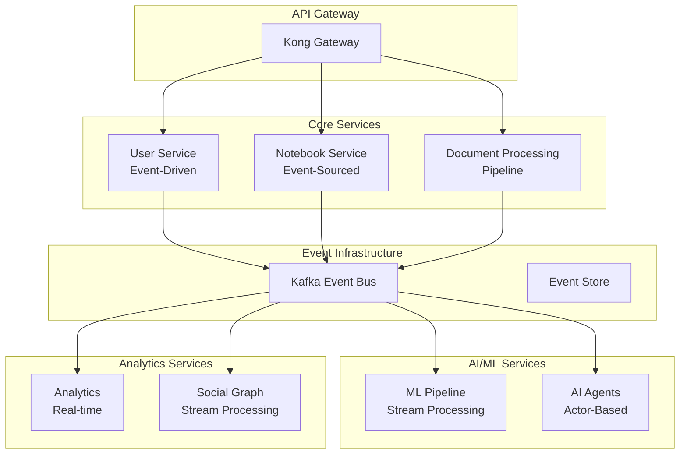

# Aether AI Platform - Backend Design & Todo

## Overview

This document outlines the backend architecture and implementation roadmap for the Aether AI platform. The current system uses localStorage for data persistence and mock services. This design specifies the production-ready backend services needed to support the full platform capabilities.

## Current State

- **Frontend**: React 19 + TypeScript + Vite
- **Backend**: Go backend repository at https://github.com/Tributary-ai-services/aether-be
- **Data Persistence**: localStorage (temporary, to be replaced with Neo4j)
- **AI Integration**: AudiModal API (configured)
- **Authentication**: None (local development, to be replaced with Keycloak)
- **Database**: None (JSON data in memory, to be replaced with Neo4j)

## Production Infrastructure (Already Deployed)

- **Authentication**: Keycloak (SSO, OAuth2, OIDC)
- **Message Queue**: Kafka cluster
- **Monitoring**: Prometheus + AlertManager (tracking DeepLake & AudiModal metrics)
- **Databases**: PostgreSQL + Redis (production ready)
- **AI Services**: DeepLake vector storage, AudiModal processing

## Target Architecture

### Technology Stack
- **Runtime**: Go 1.21+
- **Framework**: Gin / Fiber / Echo
- **Database**: Neo4j (primary graph database) + Redis (cache/sessions)
- **Graph Driver**: Neo4j Go Driver
- **Authentication**: Keycloak (OIDC/OAuth2/SAML) via go-oidc
- **File Storage**: AWS S3 / MinIO
- **Search**: Neo4j full-text search + APOC procedures
- **Message Queue**: Kafka (existing deployment) via Sarama/Confluent Go client
- **Monitoring**: Prometheus (existing) + OpenTelemetry Go SDK
- **Documentation**: OpenAPI/Swagger via swaggo/swag
- **Testing**: Testify + Ginkgo/Gomega
- **Migration**: golang-migrate for Neo4j schema versioning

---

## Neo4j Graph Database Design

### Complete Neo4j Schema

```cypher
// ============================================================================
// NODE DEFINITIONS
// ============================================================================

// Users (synced with Keycloak)
CREATE (u:User {
  id: $userId, // UUID
  keycloak_id: $keycloakId, // Keycloak user ID
  email: $email,
  username: $username,
  full_name: $fullName,
  avatar_url: $avatarUrl,
  
  // Keycloak sync data
  keycloak_roles: $keycloakRoles, // Array of roles
  keycloak_groups: $keycloakGroups, // Array of groups
  keycloak_attributes: $keycloakAttributes, // Map of attributes
  
  // Local app data
  preferences: $preferences, // Map of user preferences
  status: $status, // 'active', 'inactive', 'suspended'
  
  // Timestamps
  created_at: datetime(),
  updated_at: datetime(),
  last_login_at: datetime(),
  last_sync_at: datetime()
})

// Notebooks
CREATE (n:Notebook {
  id: $notebookId,
  name: $name,
  description: $description,
  visibility: $visibility, // 'private', 'shared', 'public'
  status: $status, // 'active', 'archived', 'deleted'
  
  // Compliance settings
  compliance_settings: $complianceSettings, // Map of compliance config
  
  // Metadata
  document_count: $documentCount,
  total_size_bytes: $totalSizeBytes,
  tags: $tags, // Array of tag names
  
  // Search optimization
  search_text: $searchText, // Combined searchable text
  
  // Timestamps
  created_at: datetime(),
  updated_at: datetime()
})

// Documents
CREATE (d:Document {
  id: $documentId,
  original_filename: $originalFilename,
  content_type: $contentType,
  file_size: $fileSize,
  file_hash: $fileHash, // SHA256
  
  // Storage
  storage_provider: $storageProvider, // 's3', 'gcs', 'azure', 'minio'
  storage_path: $storagePath,
  storage_metadata: $storageMetadata, // Map
  
  // Processing
  processing_status: $processingStatus, // 'pending', 'processing', 'completed', 'failed'
  processing_tier: $processingTier, // AudiModal tier
  processing_metadata: $processingMetadata, // Map
  
  // Content
  extracted_text: $extractedText,
  extracted_metadata: $extractedMetadata, // Map
  
  // AudiModal integration
  audimodal_file_id: $audimodalFileId,
  audimodal_datasource_id: $audimodalDataSourceId,
  
  // Compliance
  compliance_scan_results: $complianceScanResults, // Map
  pii_detected: $piiDetected, // Boolean
  redaction_applied: $redactionApplied, // Boolean
  
  // Search optimization
  search_text: $searchText, // Combined searchable text
  
  // Timestamps
  uploaded_at: datetime(),
  processed_at: datetime()
})

// Document Versions
CREATE (dv:DocumentVersion {
  id: $versionId,
  version_number: $versionNumber,
  storage_path: $storagePath,
  file_size: $fileSize,
  change_summary: $changeSummary,
  created_at: datetime()
})

// AI Agents
CREATE (a:Agent {
  id: $agentId,
  name: $name,
  description: $description,
  agent_type: $agentType, // 'document_processor', 'content_analyzer', etc.
  configuration: $configuration, // Map
  
  // Capabilities
  supported_media_types: $supportedMediaTypes, // Array
  max_file_size: $maxFileSize,
  
  // Status
  status: $status, // 'active', 'inactive', 'deprecated'
  version: $version,
  
  // Timestamps
  created_at: datetime(),
  updated_at: datetime()
})

// Agent Executions
CREATE (ae:AgentExecution {
  id: $executionId,
  input_data: $inputData, // Map
  output_data: $outputData, // Map
  status: $status, // 'pending', 'running', 'completed', 'failed'
  error_message: $errorMessage,
  
  // Resource usage
  processing_time_ms: $processingTimeMs,
  tokens_used: $tokensUsed,
  cost_cents: $costCents,
  
  // Timestamps
  started_at: datetime(),
  completed_at: datetime()
})

// Workflows
CREATE (w:Workflow {
  id: $workflowId,
  name: $name,
  description: $description,
  definition: $definition, // Map of workflow steps/nodes
  triggers: $triggers, // Map of event triggers
  status: $status, // 'active', 'inactive', 'draft'
  version: $version,
  
  // Timestamps
  created_at: datetime(),
  updated_at: datetime()
})

// Workflow Executions
CREATE (we:WorkflowExecution {
  id: $executionId,
  trigger_event: $triggerEvent, // Map
  execution_context: $executionContext, // Map
  status: $status, // 'running', 'completed', 'failed'
  error_message: $errorMessage,
  results: $results, // Map
  
  // Timestamps
  started_at: datetime(),
  completed_at: datetime()
})

// Communities (for sharing and collaboration)
CREATE (c:Community {
  id: $communityId,
  name: $name,
  description: $description,
  type: $type, // 'public', 'private', 'organization'
  status: $status, // 'active', 'inactive'
  
  // Settings
  settings: $settings, // Map of community settings
  
  // Timestamps
  created_at: datetime(),
  updated_at: datetime()
})

// Tags (for categorization and discovery)
CREATE (t:Tag {
  name: $tagName,
  category: $category,
  usage_count: $usageCount,
  description: $description,
  created_at: datetime()
})

// Search Queries (for analytics)
CREATE (sq:SearchQuery {
  id: $queryId,
  query_text: $queryText,
  query_type: $queryType, // 'text', 'semantic', 'hybrid'
  filters: $filters, // Map
  results_count: $resultsCount,
  response_time_ms: $responseTimeMs,
  created_at: datetime()
})

// ML Insights
CREATE (mi:MLInsight {
  id: $insightId,
  type: $type, // 'content_analysis', 'usage_pattern', 'performance', 'security'
  category: $category, // 'productivity', 'compliance', 'performance', 'security'
  severity: $severity, // 'info', 'warning', 'critical'
  title: $title,
  description: $description,
  data: $data, // Map
  status: $status, // 'new', 'acknowledged', 'resolved', 'dismissed'
  
  // Timestamps
  created_at: datetime(),
  expires_at: datetime(),
  reviewed_at: datetime()
})

// Anomalies
CREATE (an:Anomaly {
  id: $anomalyId,
  type: $type, // 'content', 'access', 'performance', 'security'
  severity: $severity, // 'low', 'medium', 'high', 'critical'
  title: $title,
  description: $description,
  detection_data: $detectionData, // Map
  status: $status, // 'new', 'investigating', 'resolved', 'false_positive'
  resolution_notes: $resolutionNotes,
  
  // Timestamps
  detected_at: datetime(),
  resolved_at: datetime()
})

// System Configuration
CREATE (sc:SystemConfig {
  key: $key,
  value: $value, // Map or primitive
  description: $description,
  category: $category, // 'general', 'security', 'integrations', 'ml', 'storage'
  updated_at: datetime()
})

// Integrations (AudiModal, etc.)
CREATE (i:Integration {
  id: $integrationId,
  name: $name,
  type: $type, // 'audimodal', 's3', 'oauth', 'webhook'
  configuration: $configuration, // Map
  status: $status, // 'active', 'inactive', 'error'
  health_status: $healthStatus, // 'healthy', 'degraded', 'unhealthy'
  last_health_check: datetime(),
  created_at: datetime(),
  updated_at: datetime()
})

// Audit Logs
CREATE (al:AuditLog {
  id: $auditId,
  action: $action, // 'create', 'read', 'update', 'delete', 'login', 'logout'
  resource_type: $resourceType, // 'user', 'notebook', 'document', 'agent'
  resource_id: $resourceId,
  details: $details, // Map
  ip_address: $ipAddress,
  user_agent: $userAgent,
  created_at: datetime()
})

// Activity Events (for feeds and notifications)
CREATE (ae:ActivityEvent {
  id: $eventId,
  event_type: $eventType, // 'created', 'updated', 'shared', 'liked', 'commented'
  details: $details, // Map of event details
  visibility: $visibility, // 'public', 'private', 'followers'
  created_at: datetime()
})

// Comments
CREATE (cm:Comment {
  id: $commentId,
  content: $content,
  status: $status, // 'active', 'hidden', 'deleted'
  created_at: datetime(),
  updated_at: datetime()
})

// Ratings
CREATE (r:Rating {
  id: $ratingId,
  rating: $rating, // 1-5 scale
  review: $review, // Optional text review
  created_at: datetime(),
  updated_at: datetime()
})

// ============================================================================
// RELATIONSHIP DEFINITIONS
// ============================================================================

// User Relationships
(:User)-[:FOLLOWS {followed_at: datetime()}]->(:User)
(:User)-[:BLOCKS {blocked_at: datetime()}]->(:User)
(:User)-[:MEMBER_OF {role: 'admin|member|viewer', joined_at: datetime(), status: 'active|inactive'}]->(:Community)

// Ownership and Creation
(:User)-[:OWNS {created_at: datetime()}]->(:Notebook)
(:User)-[:OWNS {created_at: datetime()}]->(:Agent)
(:User)-[:OWNS {created_at: datetime()}]->(:Workflow)
(:User)-[:CREATED {created_at: datetime()}]->(:Community)

// Notebook Hierarchy and Relationships
(:Notebook)-[:PARENT_OF]->(:Notebook) // Hierarchical structure
(:Notebook)-[:CONTAINS {added_at: datetime()}]->(:Document)
(:Document)-[:VERSION_OF {version_number: int, created_at: datetime()}]->(:DocumentVersion)

// Collaboration and Permissions
(:User)-[:COLLABORATES_ON {
  permission: 'read|write|admin', 
  granted_at: datetime(), 
  granted_by: $userId,
  accepted_at: datetime(),
  status: 'pending|active|revoked'
}]->(:Notebook)

// Sharing and Social Features
(:User)-[:SHARED {shared_at: datetime(), message: $message, visibility: $visibility}]->(:Notebook)
(:User)-[:STARRED {starred_at: datetime()}]->(:Notebook)
(:User)-[:FORKED {forked_at: datetime(), fork_reason: $reason}]->(:Notebook)
(:User)-[:LIKED {liked_at: datetime()}]->(:Notebook)
(:User)-[:LIKED {liked_at: datetime()}]->(:Document)

// Community Relationships
(:Notebook)-[:SHARED_IN {shared_at: datetime(), featured: boolean, pinned: boolean}]->(:Community)
(:Community)-[:CONTAINS]->(:Notebook)

// Content and Tagging
(:Notebook)-[:TAGGED_WITH {tagged_at: datetime(), tagged_by: $userId}]->(:Tag)
(:Document)-[:TAGGED_WITH {tagged_at: datetime(), tagged_by: $userId}]->(:Tag)
(:User)-[:INTERESTED_IN {weight: float, last_interaction: datetime()}]->(:Tag)

// AI and Processing
(:Agent)-[:EXECUTED_BY {executed_at: datetime()}]->(:AgentExecution)
(:AgentExecution)-[:PROCESSED]->(:Document)
(:AgentExecution)-[:TRIGGERED_BY]->(:User)
(:AgentExecution)-[:IN_NOTEBOOK]->(:Notebook)

(:Workflow)-[:EXECUTED_BY {executed_at: datetime()}]->(:WorkflowExecution)
(:WorkflowExecution)-[:TRIGGERED_BY]->(:User)
(:WorkflowExecution)-[:PROCESSED]->(:Document)

// Access and Activity Tracking
(:User)-[:ACCESSED {
  accessed_at: datetime(), 
  access_type: 'view|download|edit|share',
  ip_address: $ipAddress,
  user_agent: $userAgent,
  duration_seconds: $duration
}]->(:Document)

(:User)-[:VIEWED {viewed_at: datetime(), duration_seconds: $duration}]->(:Notebook)
(:User)-[:DOWNLOADED {downloaded_at: datetime()}]->(:Document)

// Search and Discovery
(:User)-[:SEARCHED {searched_at: datetime()}]->(:SearchQuery)
(:SearchQuery)-[:RETURNED]->(:Notebook)
(:SearchQuery)-[:RETURNED]->(:Document)

// Comments and Reviews
(:User)-[:COMMENTED {commented_at: datetime()}]->(:Comment)
(:Comment)-[:ON]->(:Notebook)
(:Comment)-[:ON]->(:Document)
(:Comment)-[:REPLY_TO]->(:Comment) // Threaded comments

(:User)-[:RATED {rated_at: datetime()}]->(:Rating)
(:Rating)-[:FOR]->(:Notebook)
(:Rating)-[:FOR]->(:Document)

// Insights and Analytics
(:MLInsight)-[:ABOUT]->(:Notebook)
(:MLInsight)-[:ABOUT]->(:Document)
(:MLInsight)-[:ABOUT]->(:User)
(:MLInsight)-[:REVIEWED_BY {reviewed_at: datetime()}]->(:User)

(:Anomaly)-[:DETECTED_IN]->(:Document)
(:Anomaly)-[:DETECTED_FOR]->(:User)
(:Anomaly)-[:ASSIGNED_TO {assigned_at: datetime()}]->(:User)

// Activity Events
(:User)-[:TRIGGERED {triggered_at: datetime()}]->(:ActivityEvent)
(:ActivityEvent)-[:ABOUT]->(:Notebook)
(:ActivityEvent)-[:ABOUT]->(:Document)
(:ActivityEvent)-[:ABOUT]->(:User)

// Recommendations and Similarity
(:Notebook)-[:SIMILAR_TO {similarity_score: float, reason: $reason, computed_at: datetime()}]->(:Notebook)
(:User)-[:SIMILAR_INTERESTS {similarity_score: float, computed_at: datetime()}]->(:User)
(:Document)-[:SIMILAR_TO {similarity_score: float, method: $method}]->(:Document)

// System and Configuration
(:User)-[:UPDATED {updated_at: datetime()}]->(:SystemConfig)
(:AuditLog)-[:PERFORMED_BY]->(:User)
(:AuditLog)-[:ON_RESOURCE]->(:Notebook)
(:AuditLog)-[:ON_RESOURCE]->(:Document)

// Integration Relationships
(:Integration)-[:PROCESSES]->(:Document)
(:Integration)-[:MANAGES]->(:Notebook)
```

### Neo4j Indexes and Constraints

```cypher
// ============================================================================
// CONSTRAINTS
// ============================================================================

// Unique constraints
CREATE CONSTRAINT user_id_unique FOR (u:User) REQUIRE u.id IS UNIQUE;
CREATE CONSTRAINT user_keycloak_id_unique FOR (u:User) REQUIRE u.keycloak_id IS UNIQUE;
CREATE CONSTRAINT user_email_unique FOR (u:User) REQUIRE u.email IS UNIQUE;
CREATE CONSTRAINT notebook_id_unique FOR (n:Notebook) REQUIRE n.id IS UNIQUE;
CREATE CONSTRAINT document_id_unique FOR (d:Document) REQUIRE d.id IS UNIQUE;
CREATE CONSTRAINT agent_id_unique FOR (a:Agent) REQUIRE a.id IS UNIQUE;
CREATE CONSTRAINT workflow_id_unique FOR (w:Workflow) REQUIRE w.id IS UNIQUE;
CREATE CONSTRAINT tag_name_unique FOR (t:Tag) REQUIRE t.name IS UNIQUE;
CREATE CONSTRAINT community_id_unique FOR (c:Community) REQUIRE c.id IS UNIQUE;

// ============================================================================
// INDEXES
// ============================================================================

// Full-text search indexes
CREATE FULLTEXT INDEX notebook_search FOR (n:Notebook) ON EACH [n.name, n.description, n.search_text];
CREATE FULLTEXT INDEX document_search FOR (d:Document) ON EACH [d.original_filename, d.extracted_text, d.search_text];
CREATE FULLTEXT INDEX user_search FOR (u:User) ON EACH [u.username, u.full_name, u.email];
CREATE FULLTEXT INDEX tag_search FOR (t:Tag) ON EACH [t.name, t.description];
CREATE FULLTEXT INDEX community_search FOR (c:Community) ON EACH [c.name, c.description];

// Property indexes for performance
CREATE INDEX user_status FOR (u:User) ON (u.status);
CREATE INDEX user_created_at FOR (u:User) ON (u.created_at);
CREATE INDEX user_last_login FOR (u:User) ON (u.last_login_at);

CREATE INDEX notebook_status FOR (n:Notebook) ON (n.status);
CREATE INDEX notebook_visibility FOR (n:Notebook) ON (n.visibility);
CREATE INDEX notebook_created_at FOR (n:Notebook) ON (n.created_at);
CREATE INDEX notebook_updated_at FOR (n:Notebook) ON (n.updated_at);

CREATE INDEX document_status FOR (d:Document) ON (d.processing_status);
CREATE INDEX document_content_type FOR (d:Document) ON (d.content_type);
CREATE INDEX document_uploaded_at FOR (d:Document) ON (d.uploaded_at);
CREATE INDEX document_file_hash FOR (d:Document) ON (d.file_hash);

CREATE INDEX activity_event_type FOR (ae:ActivityEvent) ON (ae.event_type);
CREATE INDEX activity_created_at FOR (ae:ActivityEvent) ON (ae.created_at);

CREATE INDEX audit_action FOR (al:AuditLog) ON (al.action);
CREATE INDEX audit_created_at FOR (al:AuditLog) ON (al.created_at);

// Composite indexes for common queries
CREATE INDEX user_status_created FOR (u:User) ON (u.status, u.created_at);
CREATE INDEX notebook_owner_status FOR (n:Notebook) ON (n.status, n.visibility);
CREATE INDEX document_notebook_status FOR (d:Document) ON (d.processing_status, d.uploaded_at);

// ============================================================================
// PERFORMANCE OPTIMIZATIONS
// ============================================================================

// Relationship indexes for traversal performance
CREATE INDEX FOR ()-[r:OWNS]-() ON (r.created_at);
CREATE INDEX FOR ()-[r:COLLABORATES_ON]-() ON (r.permission, r.status);
CREATE INDEX FOR ()-[r:CONTAINS]-() ON (r.added_at);
CREATE INDEX FOR ()-[r:ACCESSED]-() ON (r.accessed_at, r.access_type);
CREATE INDEX FOR ()-[r:SHARED]-() ON (r.shared_at, r.visibility);
CREATE INDEX FOR ()-[r:TAGGED_WITH]-() ON (r.tagged_at);
```

---

## Go Project Structure

```
aether-be/
├── cmd/
│   ├── api/                    # Main API server
│   │   └── main.go
│   ├── worker/                 # Background worker processes
│   │   └── main.go
│   └── migrate/                # Database migration tool
│       └── main.go
├── internal/
│   ├── api/                    # API layer
│   │   ├── handlers/           # HTTP handlers
│   │   ├── middleware/         # Custom middleware
│   │   └── routes/            # Route definitions
│   ├── auth/                   # Authentication & authorization
│   │   ├── keycloak/          # Keycloak integration
│   │   ├── jwt/               # JWT handling
│   │   └── permissions/       # Permission system
│   ├── config/                 # Configuration management
│   ├── db/                     # Database layer
│   │   ├── neo4j/             # Neo4j operations
│   │   ├── redis/             # Redis operations
│   │   └── migrations/        # Schema migrations
│   ├── models/                 # Data models and DTOs
│   ├── services/               # Business logic
│   │   ├── notebook/
│   │   ├── document/
│   │   ├── user/
│   │   ├── community/
│   │   ├── search/
│   │   └── analytics/
│   ├── integrations/           # External service integrations
│   │   ├── audimodal/
│   │   ├── storage/           # S3/MinIO
│   │   └── kafka/
│   ├── utils/                  # Utility functions
│   └── workers/                # Background job workers
├── pkg/                        # Public packages (if any)
├── docs/                       # API documentation
│   └── swagger/
├── deployments/                # Docker & K8s configs
│   ├── docker/
│   └── k8s/
├── scripts/                    # Build and deployment scripts
├── tests/                      # Integration tests
├── .env.example
├── docker-compose.yml
├── go.mod
├── go.sum
├── Makefile
└── README.md
```

## Go Dependencies

```go
// Core dependencies
require (
    github.com/gin-gonic/gin v1.9.1              // HTTP framework
    github.com/neo4j/neo4j-go-driver/v5 v5.14.0  // Neo4j driver
    github.com/go-redis/redis/v8 v8.11.5          // Redis client
    github.com/Shopify/sarama v1.37.2             // Kafka client
    
    // Authentication
    github.com/coreos/go-oidc/v3 v3.7.0           // OIDC client
    github.com/golang-jwt/jwt/v5 v5.2.0           // JWT handling
    github.com/Nerzal/gocloak/v13 v13.8.0         // Keycloak admin client
    
    // Configuration & Secrets
    github.com/spf13/viper v1.17.0               // Configuration
    github.com/hashicorp/vault/api v1.10.0       // Vault client
    
    // Storage & File handling
    github.com/aws/aws-sdk-go-v2 v1.24.0         // AWS SDK
    github.com/minio/minio-go/v7 v7.0.63          // MinIO client
    
    // Monitoring & Logging
    github.com/prometheus/client_golang v1.17.0   // Prometheus metrics
    github.com/sirupsen/logrus v1.9.3            // Structured logging
    go.opentelemetry.io/otel v1.21.0             // OpenTelemetry
    
    // Utilities
    github.com/gorilla/websocket v1.5.1          // WebSocket support
    github.com/go-playground/validator/v10 v10.16.0 // Validation
    github.com/google/uuid v1.4.0                // UUID generation
    github.com/patrickmn/go-cache v2.1.0+incompatible // In-memory cache
    
    // Testing
    github.com/stretchr/testify v1.8.4           // Test assertions
    github.com/onsi/ginkgo/v2 v2.13.2            // BDD testing
    github.com/onsi/gomega v1.30.0               // Matchers
    
    // Documentation
    github.com/swaggo/swag v1.16.2               // Swagger generation
    github.com/swaggo/gin-swagger v1.6.0         // Gin Swagger middleware
)
```

## Go Configuration Structure

```go
// internal/config/config.go
type Config struct {
    Server   ServerConfig   `mapstructure:"server"`
    Neo4j    Neo4jConfig    `mapstructure:"neo4j"`
    Redis    RedisConfig    `mapstructure:"redis"`
    Keycloak KeycloakConfig `mapstructure:"keycloak"`
    Kafka    KafkaConfig    `mapstructure:"kafka"`
    Storage  StorageConfig  `mapstructure:"storage"`
    Vault    VaultConfig    `mapstructure:"vault"`
    Logging  LoggingConfig  `mapstructure:"logging"`
}

type ServerConfig struct {
    Port         int           `mapstructure:"port" default:"8080"`
    Host         string        `mapstructure:"host" default:"0.0.0.0"`
    ReadTimeout  time.Duration `mapstructure:"read_timeout" default:"30s"`
    WriteTimeout time.Duration `mapstructure:"write_timeout" default:"30s"`
}

type Neo4jConfig struct {
    URI      string `mapstructure:"uri" validate:"required"`
    Username string `mapstructure:"username" validate:"required"`
    Password string `mapstructure:"password" validate:"required"`
    Database string `mapstructure:"database" default:"neo4j"`
    MaxConnPoolSize int `mapstructure:"max_conn_pool_size" default:"100"`
}

type KeycloakConfig struct {
    URL          string `mapstructure:"url" validate:"required"`
    Realm        string `mapstructure:"realm" validate:"required"`
    ClientID     string `mapstructure:"client_id" validate:"required"`
    ClientSecret string `mapstructure:"client_secret" validate:"required"`
    AdminUser    string `mapstructure:"admin_user"`
    AdminPass    string `mapstructure:"admin_pass"`
}
```

---

## Backend Services Architecture

### 1. Authentication Integration Service (Keycloak)
**Priority: High**

#### Features (Keycloak Integration)
- [ ] Keycloak client configuration
- [ ] OIDC/OAuth2 token validation
- [ ] User session management via Keycloak
- [ ] Role and permission mapping from Keycloak
- [ ] SSO integration with enterprise providers
- [ ] Token introspection and refresh
- [ ] Keycloak admin API integration

#### API Endpoints (Proxy/Integration Layer)
```
GET    /auth/login            # Redirect to Keycloak
POST   /auth/logout           # Keycloak logout + local cleanup
GET    /auth/callback         # OIDC callback handler
POST   /auth/refresh          # Token refresh via Keycloak
GET    /auth/me              # User info from token
GET    /auth/permissions     # User permissions from Keycloak
POST   /auth/verify-token    # Token validation
```

#### Implementation Tasks
- [ ] Keycloak realm configuration
- [ ] Client registration in Keycloak
- [ ] OIDC middleware setup (go-oidc + coreos/go-oidc)
- [ ] JWT token validation and caching (go-jwt)
- [ ] Role mapping (Keycloak roles → app permissions)
- [ ] Session synchronization with Keycloak + Redis
- [ ] Keycloak event listeners via webhooks (Gin handlers)
- [ ] Multi-tenant realm support (if needed)
- [ ] Go Keycloak Admin Client (Nerzal/gocloak)
- [ ] CORS configuration for frontend integration

---

### 2. User Management Service
**Priority: High**

#### Features (Keycloak-Integrated)
- [ ] User profile synchronization with Keycloak
- [ ] Local user preferences and settings
- [ ] Avatar upload and management
- [ ] User search (Keycloak + local data)
- [ ] Keycloak user provisioning
- [ ] Group and role management via Keycloak Admin API

#### API Endpoints
```
GET    /users/me              # From token + local data
PUT    /users/me              # Update local preferences
POST   /users/me/avatar       # Avatar upload
GET    /users/{id}            # User info (public data)
GET    /users/search          # Search Keycloak + local
POST   /users/sync            # Force Keycloak sync
GET    /users/roles           # User's Keycloak roles
GET    /admin/users           # Via Keycloak Admin API
PUT    /admin/users/{id}/roles # Update via Keycloak
```

#### Implementation Tasks
- [ ] Neo4j Go driver setup with connection pooling
- [ ] User sync service (Keycloak → Neo4j) with Go routines
- [ ] Profile image upload to S3 using AWS SDK for Go
- [ ] Combined search (Keycloak Admin API + Neo4j Cypher queries)
- [ ] User preferences management (Neo4j property storage)
- [ ] Keycloak event webhook handlers (Gin HTTP handlers)
- [ ] Batch user import using Neo4j Go driver transactions
- [ ] GDPR compliance with structured logging (logrus/zap)

---

### 3. Notebook Management Service
**Priority: High**

#### Features
- [ ] Notebook CRUD operations
- [ ] Hierarchical notebook structure
- [ ] Notebook sharing and collaboration
- [ ] Permission management
- [ ] Notebook templates
- [ ] Bulk operations
- [ ] Compliance settings management

#### API Endpoints
```
GET    /notebooks
POST   /notebooks
GET    /notebooks/{id}
PUT    /notebooks/{id}
DELETE /notebooks/{id}
GET    /notebooks/{id}/children
POST   /notebooks/{id}/share
PUT    /notebooks/{id}/permissions
GET    /notebooks/{id}/activity
POST   /notebooks/{id}/duplicate

# Bulk upload operations
POST   /notebooks/{id}/upload           # Returns 202 with job IDs
GET    /notebooks/{id}/upload/status    # Get all upload jobs for notebook
WS     /ws/notebooks/{id}/uploads       # Real-time upload updates for notebook
```

#### Implementation Tasks
- [ ] Neo4j hierarchy management with Cypher queries
- [ ] Permission inheritance through graph traversal algorithms
- [ ] Collaboration features using Neo4j relationship queries
- [ ] Activity logging as Neo4j audit nodes and relationships
- [ ] Compliance settings validation using Go struct validation
- [ ] Notebook templates system with Neo4j template nodes
- [ ] Real-time collaboration (Gorilla WebSocket + Neo4j change streams)
- [ ] Concurrent access handling with Go mutexes and channels

---

### 4. Document Processing Service
**Priority: High**

#### Features
- [ ] File upload handling
- [ ] Multi-format support (35+ formats)
- [ ] AudiModal API integration
- [ ] Processing queue management
- [ ] Content extraction and indexing
- [ ] Version control
- [ ] Compliance scanning

#### API Endpoints
```
# Asynchronous Upload Operations
POST   /documents/upload                    # Returns 202 Accepted with job ID
GET    /documents/upload/{jobId}/status     # Get upload/processing status
GET    /documents/upload/{jobId}/progress   # Get detailed progress info
DELETE /documents/upload/{jobId}           # Cancel upload job

# Document Management
GET    /documents/{id}                      # Get document metadata
PUT    /documents/{id}                      # Update document metadata
DELETE /documents/{id}                     # Delete document
GET    /documents/{id}/download             # Download document
GET    /documents/{id}/preview              # Get document preview
GET    /documents/{id}/versions             # Get document versions

# AudiModal Integration
POST   /webhooks/audimodal                  # AudiModal webhook handler
GET    /documents/audimodal/{jobId}/status  # Get AudiModal job status

# WebSocket Endpoints
WS     /ws/upload/{jobId}                   # Real-time upload progress
WS     /ws/processing/{jobId}               # Real-time processing updates
```

#### Implementation Tasks
- [ ] **Asynchronous Upload Handling**
  - [ ] Upload job creation and tracking (Neo4j job nodes)
  - [ ] Background file processing with Go worker pools
  - [ ] Job status API with detailed progress tracking
  - [ ] WebSocket real-time progress broadcasting
  - [ ] Job cancellation and cleanup mechanisms
- [ ] **File Processing Pipeline**
  - [ ] Multipart file upload handling (Gin multipart middleware)
  - [ ] File validation and virus scanning (ClamAV Go bindings)
  - [ ] Chunked upload support for large files
  - [ ] Upload resumption for interrupted transfers
- [ ] **AudiModal Integration**
  - [ ] Asynchronous AudiModal API integration
  - [ ] AudiModal webhook handling for processing updates
  - [ ] Processing queue (Kafka Go producer/consumer)
  - [ ] Multi-tier processing status tracking
- [ ] **Advanced Features**
  - [ ] Document versioning in Neo4j with relationships
  - [ ] Thumbnail generation (ImageMagick Go bindings)
  - [ ] Content extraction pipeline with Go worker pools
  - [ ] Compliance scanning integration with concurrent processing
  - [ ] Batch upload operations
  - [ ] Upload analytics and metrics collection

---

### 5. Search Service
**Priority: Medium**

#### Features (Neo4j-based)
- [ ] Neo4j full-text search indexes
- [ ] Graph-aware search (relationships matter)
- [ ] Multi-node search (Users, Notebooks, Documents, Communities)
- [ ] APOC procedures for advanced search
- [ ] Search ranking with graph algorithms
- [ ] Semantic search via DeepLake integration
- [ ] Social search (friends' content prioritized)

#### API Endpoints
```
GET    /search                    # Multi-node full-text search
GET    /search/notebooks          # Notebook-specific search
GET    /search/documents          # Document-specific search
GET    /search/users              # User search with social context
GET    /search/communities        # Community search
POST   /search/semantic           # DeepLake semantic search
GET    /search/suggestions        # Auto-complete with Neo4j
GET    /search/related            # Graph-based related content
GET    /search/history            # User search history
```

#### Implementation Tasks
- [ ] Neo4j full-text search setup with Cypher queries
- [ ] APOC procedures integration via Neo4j Go driver
- [ ] Graph algorithm integration (Neo4j Graph Data Science)
- [ ] Social search implementation using graph traversal
- [ ] Search result ranking with weighted relationships
- [ ] Auto-complete using Neo4j pattern matching
- [ ] DeepLake vector search integration (HTTP client)
- [ ] Search analytics using Cypher aggregation queries
- [ ] Concurrent search execution with Go goroutines
- [ ] Search result caching with Redis and Go-Redis client

---

### 6. Community & Sharing Service
**Priority: Medium**

#### Features (Neo4j-based)
- [ ] User follow/unfollow system
- [ ] Community creation and management
- [ ] Notebook sharing and discovery
- [ ] Social interactions (likes, comments, ratings)
- [ ] Recommendation engine
- [ ] Content curation and featuring
- [ ] User reputation system

#### API Endpoints
```
GET    /community/feed
GET    /community/discover
GET    /community/{id}
POST   /community
GET    /community/{id}/notebooks
POST   /notebooks/{id}/share
GET    /notebooks/{id}/interactions
POST   /notebooks/{id}/like
POST   /notebooks/{id}/comment
GET    /users/{id}/followers
POST   /users/{id}/follow
GET    /recommendations/notebooks
GET    /recommendations/users
```

#### Implementation Tasks
- [ ] Neo4j Go driver with optimized connection pooling
- [ ] Social graph queries with Cypher performance tuning
- [ ] Recommendation algorithms (collaborative filtering in Go)
- [ ] Real-time activity feeds using WebSocket broadcasting
- [ ] Content moderation tools with ML model integration
- [ ] Privacy controls using Neo4j relationship properties
- [ ] Community engagement analytics with Cypher aggregations
- [ ] Graph-based discovery using similarity algorithms
- [ ] Background job processing with Go worker pools
- [ ] Rate limiting for social interactions using Redis

---

### 7. AI Agent Service
**Priority: Medium**

#### Features
- [ ] Agent lifecycle management
- [ ] Agent execution engine
- [ ] Custom agent development
- [ ] Agent marketplace
- [ ] Execution monitoring
- [ ] Resource management
- [ ] Agent versioning

#### API Endpoints
```
GET    /agents
POST   /agents
GET    /agents/{id}
PUT    /agents/{id}
DELETE /agents/{id}
POST   /agents/{id}/execute
GET    /agents/{id}/executions
GET    /agents/marketplace
POST   /agents/{id}/install
```

#### Implementation Tasks
- [ ] Agent runtime environment (Go plugin system or containers)
- [ ] Execution sandboxing (Docker containers or Go sandboxing)
- [ ] Resource monitoring with Prometheus Go client
- [ ] Agent marketplace using Neo4j catalog nodes
- [ ] Custom agent SDK (Go packages and interfaces)
- [ ] Execution queue management with Kafka Go consumer groups
- [ ] Result caching with Redis and Go serialization
- [ ] Agent lifecycle management with Go context cancellation

---

### 7. Workflow Automation Service
**Priority: Medium**

#### Features
- [ ] Workflow designer
- [ ] Event-driven triggers
- [ ] Workflow execution engine
- [ ] Monitoring and logging
- [ ] Error handling and retries
- [ ] Conditional logic
- [ ] Integration connectors

#### API Endpoints
```
GET    /workflows
POST   /workflows
GET    /workflows/{id}
PUT    /workflows/{id}
DELETE /workflows/{id}
POST   /workflows/{id}/execute
GET    /workflows/{id}/executions
POST   /workflows/{id}/trigger
```

#### Implementation Tasks
- [ ] Workflow definition schema (Go structs with JSON tags)
- [ ] Execution engine using Go channels and goroutines
- [ ] Event trigger system with Kafka consumers
- [ ] Conditional logic processor (Go switch/if statements)
- [ ] Error handling and retries with exponential backoff
- [ ] Workflow monitoring with Prometheus metrics
- [ ] Integration connectors as Go interfaces
- [ ] State machine implementation for workflow steps

---

### 8. Analytics & Insights Service
**Priority: Low**

#### Features
- [ ] Usage analytics
- [ ] Performance metrics
- [ ] ML-powered insights
- [ ] Anomaly detection
- [ ] Custom dashboards
- [ ] Report generation
- [ ] Data export

#### API Endpoints
```
GET    /analytics/overview
GET    /analytics/usage
GET    /analytics/performance
GET    /insights
GET    /insights/{id}
PUT    /insights/{id}/status
GET    /anomalies
PUT    /anomalies/{id}/resolve
```

#### Implementation Tasks
- [ ] Metrics collection using Prometheus Go client
- [ ] Data aggregation pipelines with Go worker pools
- [ ] ML insight generation via AudiModal API integration
- [ ] Anomaly detection algorithms in Go (statistical analysis)
- [ ] Dashboard API with Gin REST endpoints
- [ ] Report generation (PDF/Excel using Go libraries)
- [ ] Data visualization endpoints (JSON/CSV export)
- [ ] Time-series data processing with InfluxDB Go client

---

### 9. Notification Service
**Priority: Low**

#### Features
- [ ] Real-time notifications
- [ ] Email notifications
- [ ] Push notifications
- [ ] Notification preferences
- [ ] Notification history
- [ ] Batch notifications
- [ ] Template management

#### API Endpoints
```
GET    /notifications
POST   /notifications
PUT    /notifications/{id}/read
PUT    /notifications/mark-all-read
GET    /notifications/preferences
POST   /notifications/preferences
POST   /notifications/test
```

#### Implementation Tasks
- [ ] WebSocket notification system (Gorilla WebSocket)
- [ ] Email service integration (SendGrid Go SDK)
- [ ] Push notification setup (Firebase Admin Go SDK)
- [ ] Notification queue processing with Kafka consumers
- [ ] Template engine (Go html/template or text/template)
- [ ] Preference management in Neo4j user nodes
- [ ] Notification analytics with Prometheus counters
- [ ] Real-time notification broadcasting with Go channels

---

### 10. Secret Management Service
**Priority: High**

#### Features
- [ ] Centralized secret storage and retrieval
- [ ] Secret rotation automation
- [ ] Access control and auditing
- [ ] Emergency break-glass procedures
- [ ] Secret versioning
- [ ] Encryption key lifecycle management
- [ ] Integration with all services

#### API Endpoints
```
GET    /secrets/{service}/{key}
POST   /secrets/{service}/{key}/rotate
GET    /secrets/{service}/list
GET    /secrets/audit/{service}
POST   /secrets/emergency-access
GET    /secrets/health
```

#### Implementation Tasks
- [ ] HashiCorp Vault Go client integration
- [ ] Service authentication with Vault AppRole/JWT
- [ ] Secret caching layer with Go-Cache and TTL
- [ ] Rotation webhook handlers (Gin HTTP endpoints)
- [ ] Audit logging with structured logging (logrus/zap)
- [ ] Emergency access procedures with break-glass tokens
- [ ] Development secrets management (.env with validation)
- [ ] Secret usage monitoring with Prometheus metrics
- [ ] Automatic secret refresh with Go tickers

---

### 11. File Storage Service
**Priority: High**

#### Features
- [ ] Multi-provider support (S3, GCS, Azure)
- [ ] File upload/download
- [ ] Presigned URLs
- [ ] File compression
- [ ] CDN integration
- [ ] File encryption
- [ ] Backup and archival

#### API Endpoints
```
POST   /storage/upload
GET    /storage/{id}/download
GET    /storage/{id}/url
DELETE /storage/{id}
POST   /storage/{id}/copy
GET    /storage/{id}/metadata
```

#### Implementation Tasks
- [ ] Multi-provider abstraction layer (Go interfaces)
- [ ] Presigned URL generation (AWS SDK for Go)
- [ ] File encryption at rest (Go crypto libraries)
- [ ] CDN integration (CloudFront/CloudFlare Go SDKs)
- [ ] File compression (Go compress/gzip, compress/zlib)
- [ ] Backup automation with S3 lifecycle policies
- [ ] Storage analytics with Prometheus metrics
- [ ] Concurrent file uploads with Go worker pools

---

## Infrastructure & DevOps Todo

### Database Setup
**Neo4j (Primary Graph Database)**
- [ ] Neo4j cluster setup for production
- [ ] Neo4j development environment setup
- [ ] Graph database schema versioning system
- [ ] Neo4j driver connection pooling
- [ ] Neo4j monitoring integration with existing Prometheus
- [ ] Neo4j backup automation and procedures
- [ ] Neo4j cluster read replicas configuration
- [ ] Neo4j security hardening (authentication, authorization, encryption)

**Redis (Production Ready)**
- ✅ Redis cluster setup (already deployed)
- [ ] Session management configuration
- [ ] Cache invalidation strategies
- [ ] Integration with existing monitoring
- [ ] Redis security configuration review


### Message Queues
**Kafka (Production Ready)**
- ✅ Kafka cluster setup (already deployed)
- [ ] Topic configuration for Aether services
- [ ] Consumer group management
- [ ] Integration with existing monitoring
- [ ] Schema registry setup
- [ ] Dead letter topic configuration

### Search Infrastructure
**Neo4j-based Search (Primary)**
- [ ] Neo4j full-text search indexes on multiple node types
- [ ] APOC procedures for advanced graph search
- [ ] Graph algorithm integration (PageRank, similarity scoring)
- [ ] Search result caching with Redis
- [ ] Neo4j search performance optimization
- [ ] Integration with existing monitoring
- [ ] Search analytics collection using graph patterns

### API Gateway & Load Balancing
- [ ] API Gateway setup (Kong/Nginx)
- [ ] Load balancer configuration
- [ ] SSL/TLS termination
- [ ] Rate limiting
- [ ] API versioning
- [ ] Request/response logging

### Monitoring & Observability
**Prometheus (Production Ready)**
- ✅ Prometheus setup (already deployed)
- ✅ DeepLake & AudiModal metrics collection (already configured)
- ✅ AlertManager setup (already configured)
- [ ] Aether service metrics integration
- [ ] Custom Grafana dashboards for Aether services
- [ ] Application performance metrics
- [ ] Log aggregation (ELK/Loki) integration
- [ ] Distributed tracing with existing setup
- [ ] Error tracking (Sentry) integration
- [ ] API endpoint monitoring
- [ ] Neo4j performance monitoring

### Secret Management
**HashiCorp Vault / AWS Secrets Manager / Kubernetes Secrets**
- [ ] Secret management system deployment
- [ ] Secret rotation policies
- [ ] Application secret integration
- [ ] Database credential management
- [ ] API key management
- [ ] Certificate management
- [ ] Encryption key management

**Secret Categories**
- [ ] Database credentials (Neo4j, Redis)
- [ ] API keys (AudiModal, third-party services)
- [ ] Keycloak credentials:
  - Admin API credentials
  - Client secret for Aether app
  - Service account credentials
  - Realm signing keys
- [ ] Encryption keys for data at rest
- [ ] SSL/TLS certificates
- [ ] Kafka SASL/SSL credentials

**Implementation Tasks**
- [ ] Vault/Secrets Manager setup
- [ ] Secret injection at runtime (not in env files)
- [ ] Automatic secret rotation
- [ ] Audit logging for secret access
- [ ] Emergency access procedures
- [ ] Development vs Production secret separation
- [ ] CI/CD pipeline secret management

### Security
- [ ] WAF configuration
- [ ] DDoS protection
- [ ] Security scanning
- [ ] Vulnerability management
- [ ] SSL certificate management
- [ ] Security headers
- [ ] OWASP compliance

### CI/CD Pipeline
- [ ] Docker containerization
- [ ] Kubernetes deployment
- [ ] CI/CD pipeline setup
- [ ] Automated testing
- [ ] Database migration automation
- [ ] Deployment strategies (blue/green)
- [ ] Rollback procedures

### Documentation
- [ ] API documentation (OpenAPI)
- [ ] Architecture documentation
- [ ] Deployment guides
- [ ] Troubleshooting guides
- [ ] Security documentation
- [ ] Compliance documentation

---

## Integration Requirements

### AudiModal Integration
- [ ] SDK integration
- [ ] Webhook handling
- [ ] File processing workflows
- [ ] Compliance settings mapping
- [ ] Error handling and retries
- [ ] Usage monitoring
- [ ] Cost tracking

### External Services
- [ ] OAuth providers (Google, Microsoft, GitHub)
- [ ] Email service (SendGrid/SES)
- [ ] SMS service (Twilio)
- [ ] Cloud storage providers
- [ ] CDN providers
- [ ] Payment processing (if needed)

### Third-party APIs
- [ ] Rate limiting handling
- [ ] API key management
- [ ] Service health monitoring
- [ ] Fallback strategies
- [ ] Cost monitoring

---

## Migration Strategy

### Phase 1: Core Services (Months 1-2)
**Development Environment Setup**
1. Go project structure and dependency management
2. Neo4j + Redis development instances
3. Keycloak development setup and realm configuration
4. Authentication Integration Service (Keycloak Go client)
5. User Management Service (Keycloak + Neo4j integrated)
6. Neo4j schema versioning and migration system (Go-based)
7. Basic API server with Gin framework and OIDC middleware
8. Docker development environment setup
9. Makefile for common development tasks

### Phase 2: Content Management (Months 2-3)
**Core Functionality**
1. Notebook Management Service (Go + Neo4j)
2. Document Processing Service (Go workers + Kafka)
3. File Storage Service (Go + AWS SDK)
4. Enhanced AudiModal integration with Kafka Go client
5. Prometheus metrics integration
6. Structured logging with logrus/zap
7. Unit and integration testing setup

### Phase 3: Community & Search (Months 3-4)
**Social Features & Discovery**
1. Neo4j-powered Community Service
2. Neo4j-based Search Service with full-text and graph search
3. Social sharing and discovery features using graph relationships
4. Graph-based recommendation engine with similarity algorithms

### Phase 4: AI & Automation (Months 4-5)
**Advanced AI Features**
1. AI Agent Service
2. Workflow Automation Service
3. Kafka-based ML processing pipelines
4. DeepLake semantic search integration

### Phase 5: Analytics & Optimization (Months 5-6)
**Performance & Insights**
1. Analytics & Insights Service
2. Notification Service
3. Performance optimization
4. Advanced community features

### Data Migration
- [ ] Export data from localStorage format
- [ ] Transform to Neo4j graph schema (nodes and relationships)
- [ ] Validate graph data integrity and relationships
- [ ] Batch import procedures using Neo4j LOAD CSV and APOC
- [ ] Graph data validation and constraint verification
- [ ] User notification and training

### Keycloak Configuration
**Realm Setup**
- [ ] Create Aether realm in Keycloak
- [ ] Configure identity providers (Google, Microsoft, GitHub, SAML)
- [ ] Setup client for Aether application
- [ ] Configure client scopes and mappers
- [ ] Setup authorization policies

**Roles and Groups**
- [ ] Define Keycloak roles:
  - `aether-admin` - Full system access
  - `aether-user` - Standard user access
  - `aether-viewer` - Read-only access
  - `notebook-admin` - Notebook management
  - `compliance-officer` - Compliance features
- [ ] Create groups for organization/team management
- [ ] Setup role inheritance and composites

**Client Configuration**
```json
{
  "clientId": "aether-app",
  "protocol": "openid-connect",
  "publicClient": false,
  "standardFlowEnabled": true,
  "implicitFlowEnabled": false,
  "directAccessGrantsEnabled": false,
  "serviceAccountsEnabled": true,
  "authorizationServicesEnabled": true,
  "redirectUris": [
    "https://aether.example.com/*",
    "http://localhost:3000/*"
  ],
  "webOrigins": ["+"],
  "defaultClientScopes": [
    "openid", "profile", "email", "roles"
  ]
}
```

**Event Configuration**
- [ ] Enable Keycloak events
- [ ] Configure webhook for user events
- [ ] Setup event listeners for:
  - User registration
  - Login/logout
  - Profile updates
  - Role changes

### Integration with Existing Infrastructure
**Kafka Integration**
- [ ] Define Aether-specific Kafka topics
  - `aether.documents.uploaded`
  - `aether.documents.processed`
  - `aether.notebooks.shared`
  - `aether.users.activity`
  - `aether.compliance.scanned`
- [ ] Consumer services for document processing
- [ ] Producer integration in API services
- [ ] Schema registry for message formats

**Prometheus Integration**
- [ ] Custom metrics for Aether services
  - Document processing rates
  - User activity metrics
  - API endpoint performance
  - Community engagement metrics
- [ ] Alerting rules for Aether-specific issues
- [ ] Grafana dashboard templates

**AudiModal & DeepLake Integration**
- [ ] Enhanced webhook handling via Kafka
- [ ] Semantic search queries to DeepLake
- [ ] Cost and usage tracking integration
- [ ] Performance monitoring for AI services

---

## DevOps Infrastructure

### Overview

Supports deployment across multiple environments with increasing complexity:
- **Development**: Local Docker Compose for rapid development
- **Testing**: Kubernetes with test data and mocking
- **Staging**: Production-like Kubernetes environment
- **Production**: Highly available Kubernetes with monitoring

### Technology Stack
- **Containerization**: Docker + Multi-stage builds
- **Orchestration**: Kubernetes (K3s for dev/test, K8s for staging/prod)
- **Configuration Management**: Kustomize
- **Service Mesh**: Istio (staging/production)
- **Monitoring**: Prometheus + Grafana + Jaeger
- **CI/CD**: GitHub Actions
- **Registry**: Docker Hub / Amazon ECR

---

### Development Environment

#### Docker Compose Setup

```yaml
# docker-compose.yml
version: '3.8'

services:
  # Aether API
  aether-api:
    build:
      context: .
      dockerfile: Dockerfile.dev
    ports:
      - "8080:8080"
    environment:
      - GO_ENV=development
      - GIN_MODE=debug
      - NEO4J_URI=bolt://neo4j:7687
      - NEO4J_USERNAME=neo4j
      - NEO4J_PASSWORD=devpassword
      - REDIS_URL=redis://redis:6379
      - KEYCLOAK_URL=http://keycloak:8080
      - KEYCLOAK_REALM=aether-dev
      - KAFKA_BROKERS=kafka:9092
      - VAULT_ADDR=http://vault:8200
      - VAULT_TOKEN=${VAULT_DEV_TOKEN}
    volumes:
      - .:/app
      - go-mod-cache:/go/pkg/mod
    depends_on:
      - neo4j
      - redis
      - kafka
      - keycloak
      - vault
    networks:
      - aether-dev

  # Neo4j Database
  neo4j:
    image: neo4j:5.15-community
    ports:
      - "7474:7474"  # HTTP
      - "7687:7687"  # Bolt
    environment:
      - NEO4J_AUTH=neo4j/devpassword
      - NEO4J_PLUGINS=["apoc"]
      - NEO4J_apoc_export_file_enabled=true
      - NEO4J_apoc_import_file_enabled=true
      - NEO4J_apoc_import_file_use__neo4j__config=true
    volumes:
      - neo4j-data:/data
      - neo4j-logs:/logs
      - neo4j-import:/var/lib/neo4j/import
      - neo4j-plugins:/plugins
    networks:
      - aether-dev

  # Redis Cache
  redis:
    image: redis:7-alpine
    ports:
      - "6379:6379"
    volumes:
      - redis-data:/data
    networks:
      - aether-dev

  # Kafka Message Queue
  zookeeper:
    image: confluentinc/cp-zookeeper:7.4.0
    environment:
      ZOOKEEPER_CLIENT_PORT: 2181
      ZOOKEEPER_TICK_TIME: 2000
    networks:
      - aether-dev

  kafka:
    image: confluentinc/cp-kafka:7.4.0
    depends_on:
      - zookeeper
    ports:
      - "9092:9092"
    environment:
      KAFKA_BROKER_ID: 1
      KAFKA_ZOOKEEPER_CONNECT: zookeeper:2181
      KAFKA_ADVERTISED_LISTENERS: PLAINTEXT://kafka:9092
      KAFKA_OFFSETS_TOPIC_REPLICATION_FACTOR: 1
      KAFKA_AUTO_CREATE_TOPICS_ENABLE: true
    volumes:
      - kafka-data:/var/lib/kafka/data
    networks:
      - aether-dev

  # Keycloak Authentication
  keycloak:
    image: quay.io/keycloak/keycloak:23.0
    command: start-dev
    ports:
      - "8180:8080"
    environment:
      KEYCLOAK_ADMIN: admin
      KEYCLOAK_ADMIN_PASSWORD: admin
      KC_DB: postgres
      KC_DB_URL: jdbc:postgresql://keycloak-db:5432/keycloak
      KC_DB_USERNAME: keycloak
      KC_DB_PASSWORD: keycloak
    depends_on:
      - keycloak-db
    networks:
      - aether-dev

  keycloak-db:
    image: postgres:15-alpine
    environment:
      POSTGRES_DB: keycloak
      POSTGRES_USER: keycloak
      POSTGRES_PASSWORD: keycloak
    volumes:
      - keycloak-data:/var/lib/postgresql/data
    networks:
      - aether-dev

  # HashiCorp Vault
  vault:
    image: vault:1.15
    ports:
      - "8200:8200"
    environment:
      VAULT_DEV_ROOT_TOKEN_ID: ${VAULT_DEV_TOKEN:-devtoken}
      VAULT_DEV_LISTEN_ADDRESS: 0.0.0.0:8200
    cap_add:
      - IPC_LOCK
    networks:
      - aether-dev

  # MinIO Object Storage
  minio:
    image: minio/minio:latest
    ports:
      - "9000:9000"
      - "9001:9001"
    environment:
      MINIO_ROOT_USER: minioadmin
      MINIO_ROOT_PASSWORD: minioadmin
    command: server /data --console-address ":9001"
    volumes:
      - minio-data:/data
    networks:
      - aether-dev

  # Monitoring Stack
  prometheus:
    image: prom/prometheus:latest
    ports:
      - "9090:9090"
    volumes:
      - ./deployments/dev/prometheus.yml:/etc/prometheus/prometheus.yml
      - prometheus-data:/prometheus
    networks:
      - aether-dev

  grafana:
    image: grafana/grafana:latest
    ports:
      - "3000:3000"
    environment:
      GF_SECURITY_ADMIN_PASSWORD: admin
    volumes:
      - grafana-data:/var/lib/grafana
      - ./deployments/dev/grafana/dashboards:/etc/grafana/provisioning/dashboards
      - ./deployments/dev/grafana/datasources:/etc/grafana/provisioning/datasources
    networks:
      - aether-dev

  jaeger:
    image: jaegertracing/all-in-one:latest
    ports:
      - "16686:16686"
      - "14268:14268"
    environment:
      COLLECTOR_OTLP_ENABLED: true
    networks:
      - aether-dev

volumes:
  neo4j-data:
  neo4j-logs:
  neo4j-import:
  neo4j-plugins:
  redis-data:
  kafka-data:
  keycloak-data:
  minio-data:
  prometheus-data:
  grafana-data:
  go-mod-cache:

networks:
  aether-dev:
    driver: bridge
```

#### Development Dockerfile

```dockerfile
# Dockerfile.dev
FROM golang:1.21-alpine AS base

WORKDIR /app

# Install development tools
RUN apk add --no-cache git make bash curl

# Install Air for hot reloading
RUN go install github.com/cosmtrek/air@latest

# Copy go mod files
COPY go.mod go.sum ./
RUN go mod download

# Copy source code
COPY . .

# Expose port
EXPOSE 8080

# Use Air for hot reloading in development
CMD ["air", "-c", ".air.toml"]
```

#### Development Scripts

```makefile
# Makefile
.PHONY: dev dev-up dev-down dev-logs dev-clean test build

# Development environment
dev-up:
	@echo "Starting development environment..."
	docker-compose up -d
	@echo "Waiting for services to be ready..."
	@sleep 30
	@echo "Development environment is ready!"
	@echo "Services available at:"
	@echo "  API: http://localhost:8080"
	@echo "  Neo4j Browser: http://localhost:7474"
	@echo "  Keycloak: http://localhost:8180"
	@echo "  Grafana: http://localhost:3000"
	@echo "  Prometheus: http://localhost:9090"
	@echo "  AlertManager: http://localhost:9093"
	@echo "  Jaeger UI: http://localhost:16686"
	@echo "  Kibana: http://localhost:5601"
	@echo "  Kafka UI: http://localhost:8080"
	@echo "  MinIO Console: http://localhost:9001"
	@echo "  Vault UI: http://localhost:8200"
	@echo "  Kong Admin: http://localhost:8001"

dev-down:
	@echo "Stopping development environment..."
	docker-compose down

dev-logs:
	docker-compose logs -f aether-api

dev-clean:
	@echo "Cleaning development environment..."
	docker-compose down -v
	docker system prune -f

# Initialize development data
dev-init:
	@echo "Initializing development data..."
	@./scripts/init-dev-data.sh

# Development testing
test-dev:
	docker-compose exec aether-api go test ./...

# Build for development
build-dev:
	docker-compose build aether-api
```

---

### Production Docker Images

#### Multi-stage Production Dockerfile

```dockerfile
# Dockerfile
# Build stage
FROM golang:1.21-alpine AS builder

WORKDIR /build

# Install build dependencies
RUN apk add --no-cache git make bash

# Copy go mod files
COPY go.mod go.sum ./
RUN go mod download

# Copy source code
COPY . .

# Build the application
RUN CGO_ENABLED=0 GOOS=linux go build -a -installsuffix cgo -o aether-api ./cmd/api
RUN CGO_ENABLED=0 GOOS=linux go build -a -installsuffix cgo -o aether-worker ./cmd/worker
RUN CGO_ENABLED=0 GOOS=linux go build -a -installsuffix cgo -o aether-migrate ./cmd/migrate

# Production stage
FROM alpine:3.18

# Install runtime dependencies
RUN apk --no-cache add ca-certificates tzdata curl

WORKDIR /app

# Create non-root user
RUN addgroup -g 1001 -S aether && \
    adduser -S aether -u 1001 -G aether

# Copy binaries from builder
COPY --from=builder /build/aether-api /app/
COPY --from=builder /build/aether-worker /app/
COPY --from=builder /build/aether-migrate /app/

# Copy configuration files
COPY --chown=aether:aether configs/ /app/configs/
COPY --chown=aether:aether scripts/ /app/scripts/

# Switch to non-root user
USER aether

# Health check
HEALTHCHECK --interval=30s --timeout=3s --start-period=5s --retries=3 \
    CMD curl -f http://localhost:8080/health || exit 1

EXPOSE 8080

# Default command
CMD ["/app/aether-api"]
```

---

### Kubernetes Deployments with Kustomize

#### Base Kubernetes Configuration

```yaml
# deployments/k8s/base/kustomization.yaml
apiVersion: kustomize.config.k8s.io/v1beta1
kind: Kustomization

resources:
  - namespace.yaml
  - configmap.yaml
  - secret.yaml
  - neo4j/
  - redis/
  - kafka/
  - keycloak/
  - vault/
  - aether-api/
  - monitoring/
  - ingress/

commonLabels:
  app.kubernetes.io/name: aether
  app.kubernetes.io/version: v1.0.0
```

```yaml
# deployments/k8s/base/namespace.yaml
apiVersion: v1
kind: Namespace
metadata:
  name: aether
  labels:
    name: aether
    istio-injection: enabled
```

```yaml
# deployments/k8s/base/configmap.yaml
apiVersion: v1
kind: ConfigMap
metadata:
  name: aether-config
  namespace: aether
data:
  LOG_LEVEL: "info"
  GIN_MODE: "release"
  METRICS_ENABLED: "true"
  WEBSOCKET_ENABLED: "true"
  UPLOAD_WORKER_COUNT: "10"
  MAX_UPLOAD_SIZE: "500MB"
```

#### Aether API Deployment

```yaml
# deployments/k8s/base/aether-api/deployment.yaml
apiVersion: apps/v1
kind: Deployment
metadata:
  name: aether-api
  namespace: aether
spec:
  replicas: 3
  selector:
    matchLabels:
      app: aether-api
  template:
    metadata:
      labels:
        app: aether-api
      annotations:
        prometheus.io/scrape: "true"
        prometheus.io/port: "8080"
        prometheus.io/path: "/metrics"
    spec:
      serviceAccountName: aether-api
      containers:
      - name: aether-api
        image: aether/api:latest
        ports:
        - containerPort: 8080
          name: http
        env:
        - name: NEO4J_URI
          valueFrom:
            secretKeyRef:
              name: aether-secrets
              key: neo4j-uri
        - name: NEO4J_USERNAME
          valueFrom:
            secretKeyRef:
              name: aether-secrets
              key: neo4j-username
        - name: NEO4J_PASSWORD
          valueFrom:
            secretKeyRef:
              name: aether-secrets
              key: neo4j-password
        - name: REDIS_URL
          valueFrom:
            secretKeyRef:
              name: aether-secrets
              key: redis-url
        - name: KEYCLOAK_CLIENT_SECRET
          valueFrom:
            secretKeyRef:
              name: aether-secrets
              key: keycloak-client-secret
        - name: VAULT_TOKEN
          valueFrom:
            secretKeyRef:
              name: aether-secrets
              key: vault-token
        envFrom:
        - configMapRef:
            name: aether-config
        resources:
          requests:
            memory: "256Mi"
            cpu: "250m"
          limits:
            memory: "512Mi"
            cpu: "500m"
        livenessProbe:
          httpGet:
            path: /health
            port: 8080
          initialDelaySeconds: 30
          periodSeconds: 10
        readinessProbe:
          httpGet:
            path: /ready
            port: 8080
          initialDelaySeconds: 5
          periodSeconds: 5
        volumeMounts:
        - name: config
          mountPath: /app/configs
          readOnly: true
      volumes:
      - name: config
        configMap:
          name: aether-config
---
apiVersion: v1
kind: Service
metadata:
  name: aether-api
  namespace: aether
spec:
  selector:
    app: aether-api
  ports:
  - port: 80
    targetPort: 8080
    name: http
  type: ClusterIP
---
apiVersion: v1
kind: ServiceAccount
metadata:
  name: aether-api
  namespace: aether
```

#### Neo4j StatefulSet

```yaml
# deployments/k8s/base/neo4j/statefulset.yaml
apiVersion: apps/v1
kind: StatefulSet
metadata:
  name: neo4j
  namespace: aether
spec:
  serviceName: neo4j
  replicas: 1
  selector:
    matchLabels:
      app: neo4j
  template:
    metadata:
      labels:
        app: neo4j
    spec:
      containers:
      - name: neo4j
        image: neo4j:5.15-community
        ports:
        - containerPort: 7474
          name: http
        - containerPort: 7687
          name: bolt
        env:
        - name: NEO4J_AUTH
          valueFrom:
            secretKeyRef:
              name: aether-secrets
              key: neo4j-auth
        - name: NEO4J_PLUGINS
          value: '["apoc"]'
        - name: NEO4J_apoc_export_file_enabled
          value: "true"
        - name: NEO4J_apoc_import_file_enabled
          value: "true"
        volumeMounts:
        - name: data
          mountPath: /data
        - name: logs
          mountPath: /logs
        resources:
          requests:
            memory: "1Gi"
            cpu: "500m"
          limits:
            memory: "2Gi"
            cpu: "1000m"
        livenessProbe:
          httpGet:
            path: /
            port: 7474
          initialDelaySeconds: 60
          periodSeconds: 30
        readinessProbe:
          httpGet:
            path: /
            port: 7474
          initialDelaySeconds: 30
          periodSeconds: 10
  volumeClaimTemplates:
  - metadata:
      name: data
    spec:
      accessModes: ["ReadWriteOnce"]
      resources:
        requests:
          storage: 20Gi
  - metadata:
      name: logs
    spec:
      accessModes: ["ReadWriteOnce"]
      resources:
        requests:
          storage: 5Gi
---
apiVersion: v1
kind: Service
metadata:
  name: neo4j
  namespace: aether
spec:
  selector:
    app: neo4j
  ports:
  - port: 7474
    name: http
  - port: 7687
    name: bolt
  clusterIP: None
```

#### Environment-Specific Overlays

```yaml
# deployments/k8s/overlays/development/kustomization.yaml
apiVersion: kustomize.config.k8s.io/v1beta1
kind: Kustomization

namespace: aether-dev

resources:
  - ../../base

patches:
  - path: api-dev-patch.yaml
    target:
      kind: Deployment
      name: aether-api

configMapGenerator:
  - name: aether-config
    behavior: merge
    literals:
      - LOG_LEVEL=debug
      - GIN_MODE=debug
      - UPLOAD_WORKER_COUNT=3

images:
  - name: aether/api
    newTag: dev-latest
```

```yaml
# deployments/k8s/overlays/development/api-dev-patch.yaml
- op: replace
  path: /spec/replicas
  value: 1
- op: add
  path: /spec/template/spec/containers/0/env/-
  value:
    name: DEBUG_MODE
    value: "true"
```

```yaml
# deployments/k8s/overlays/staging/kustomization.yaml
apiVersion: kustomize.config.k8s.io/v1beta1
kind: Kustomization

namespace: aether-staging

resources:
  - ../../base
  - hpa.yaml
  - pdb.yaml
  - istio/

patches:
  - path: api-staging-patch.yaml
    target:
      kind: Deployment
      name: aether-api

configMapGenerator:
  - name: aether-config
    behavior: merge
    literals:
      - LOG_LEVEL=info
      - UPLOAD_WORKER_COUNT=5
      - RATE_LIMIT_ENABLED=true

images:
  - name: aether/api
    newTag: staging-v1.0.0
```

```yaml
# deployments/k8s/overlays/production/kustomization.yaml
apiVersion: kustomize.config.k8s.io/v1beta1
kind: Kustomization

namespace: aether-prod

resources:
  - ../../base
  - hpa.yaml
  - pdb.yaml
  - network-policies/
  - istio/
  - monitoring/

patches:
  - path: api-prod-patch.yaml
    target:
      kind: Deployment
      name: aether-api
  - path: neo4j-prod-patch.yaml
    target:
      kind: StatefulSet
      name: neo4j

configMapGenerator:
  - name: aether-config
    behavior: merge
    literals:
      - LOG_LEVEL=warn
      - UPLOAD_WORKER_COUNT=20
      - RATE_LIMIT_ENABLED=true
      - SECURITY_HEADERS_ENABLED=true

images:
  - name: aether/api
    newTag: prod-v1.0.0
```

---

### CI/CD Pipeline

```yaml
# .github/workflows/ci-cd.yml
name: CI/CD Pipeline

on:
  push:
    branches: [main, develop]
  pull_request:
    branches: [main]

env:
  REGISTRY: ghcr.io
  IMAGE_NAME: tributary-ai-services/aether-api

jobs:
  test:
    runs-on: ubuntu-latest
    services:
      neo4j:
        image: neo4j:5.15-community
        env:
          NEO4J_AUTH: neo4j/testpassword
          NEO4J_PLUGINS: '["apoc"]'
        ports:
          - 7687:7687
        options: >-
          --health-cmd "cypher-shell -u neo4j -p testpassword 'RETURN 1'"
          --health-interval 10s
          --health-timeout 5s
          --health-retries 5
      redis:
        image: redis:7-alpine
        ports:
          - 6379:6379
        options: >-
          --health-cmd "redis-cli ping"
          --health-interval 10s
          --health-timeout 5s
          --health-retries 5

    steps:
    - uses: actions/checkout@v4
    
    - name: Set up Go
      uses: actions/setup-go@v4
      with:
        go-version: '1.21'
        
    - name: Cache Go modules
      uses: actions/cache@v3
      with:
        path: ~/go/pkg/mod
        key: ${{ runner.os }}-go-${{ hashFiles('**/go.sum') }}
        restore-keys: |
          ${{ runner.os }}-go-
          
    - name: Install dependencies
      run: go mod download
      
    - name: Run tests
      run: |
        go test -v -race -coverprofile=coverage.out ./...
        go tool cover -html=coverage.out -o coverage.html
      env:
        NEO4J_URI: bolt://localhost:7687
        NEO4J_USERNAME: neo4j
        NEO4J_PASSWORD: testpassword
        REDIS_URL: redis://localhost:6379
        
    - name: Upload coverage reports
      uses: codecov/codecov-action@v3
      with:
        file: ./coverage.out

  build:
    needs: test
    runs-on: ubuntu-latest
    permissions:
      contents: read
      packages: write
      
    steps:
    - uses: actions/checkout@v4
    
    - name: Log in to Container Registry
      uses: docker/login-action@v3
      with:
        registry: ${{ env.REGISTRY }}
        username: ${{ github.actor }}
        password: ${{ secrets.GITHUB_TOKEN }}
        
    - name: Extract metadata
      id: meta
      uses: docker/metadata-action@v5
      with:
        images: ${{ env.REGISTRY }}/${{ env.IMAGE_NAME }}
        tags: |
          type=ref,event=branch
          type=ref,event=pr
          type=sha,prefix={{branch}}-
          type=semver,pattern={{version}}
          type=semver,pattern={{major}}.{{minor}}
          
    - name: Build and push Docker image
      uses: docker/build-push-action@v5
      with:
        context: .
        file: Dockerfile
        push: true
        tags: ${{ steps.meta.outputs.tags }}
        labels: ${{ steps.meta.outputs.labels }}
        cache-from: type=gha
        cache-to: type=gha,mode=max

  deploy-dev:
    if: github.ref == 'refs/heads/develop'
    needs: build
    runs-on: ubuntu-latest
    environment: development
    
    steps:
    - uses: actions/checkout@v4
    
    - name: Set up kubectl
      uses: azure/setup-kubectl@v3
      with:
        version: 'v1.28.0'
        
    - name: Configure kubectl
      run: |
        echo "${{ secrets.KUBECONFIG_DEV }}" | base64 -d > $HOME/.kube/config
        
    - name: Deploy to development
      run: |
        cd deployments/k8s/overlays/development
        kubectl apply -k .
        kubectl rollout status deployment/aether-api -n aether-dev

  deploy-staging:
    if: github.ref == 'refs/heads/main'
    needs: build
    runs-on: ubuntu-latest
    environment: staging
    
    steps:
    - uses: actions/checkout@v4
    
    - name: Set up kubectl
      uses: azure/setup-kubectl@v3
      with:
        version: 'v1.28.0'
        
    - name: Configure kubectl
      run: |
        echo "${{ secrets.KUBECONFIG_STAGING }}" | base64 -d > $HOME/.kube/config
        
    - name: Deploy to staging
      run: |
        cd deployments/k8s/overlays/staging
        kubectl apply -k .
        kubectl rollout status deployment/aether-api -n aether-staging
        
    - name: Run integration tests
      run: |
        # Run integration tests against staging environment
        ./scripts/integration-tests.sh staging

  deploy-prod:
    if: github.ref == 'refs/heads/main' && startsWith(github.ref, 'refs/tags/')
    needs: [build, deploy-staging]
    runs-on: ubuntu-latest
    environment: production
    
    steps:
    - uses: actions/checkout@v4
    
    - name: Set up kubectl
      uses: azure/setup-kubectl@v3
      with:
        version: 'v1.28.0'
        
    - name: Configure kubectl
      run: |
        echo "${{ secrets.KUBECONFIG_PROD }}" | base64 -d > $HOME/.kube/config
        
    - name: Deploy to production
      run: |
        cd deployments/k8s/overlays/production
        kubectl apply -k .
        kubectl rollout status deployment/aether-api -n aether-prod
        
    - name: Verify deployment
      run: |
        # Health checks and smoke tests
        ./scripts/verify-deployment.sh production
```

---

### Helm Charts for Third-Party Services

```yaml
# charts/aether-infrastructure/Chart.yaml
apiVersion: v2
name: aether-infrastructure
description: Complete infrastructure stack for Aether AI Platform
type: application
version: 1.0.0
appVersion: "1.0.0"

dependencies:
  # Data Layer
  - name: neo4j
    version: "5.15.0"
    repository: "https://helm.neo4j.com/neo4j"
    condition: neo4j.enabled
  
  - name: redis
    version: "18.4.0"
    repository: "https://charts.bitnami.com/bitnami"
    condition: redis.enabled
  
  # Message Queue
  - name: kafka
    version: "26.4.0"
    repository: "https://charts.bitnami.com/bitnami"
    condition: kafka.enabled
  
  - name: schema-registry
    version: "2.5.0"
    repository: "https://confluentinc.github.io/cp-helm-charts/"
    condition: schemaRegistry.enabled
  
  # Authentication
  - name: keycloak
    version: "17.0.0"
    repository: "https://charts.bitnami.com/bitnami"
    condition: keycloak.enabled
  
  - name: vault
    version: "0.27.0"
    repository: "https://helm.releases.hashicorp.com"
    condition: vault.enabled
  
  # API Gateway
  - name: kong
    version: "2.34.0"
    repository: "https://charts.konghq.com"
    condition: kong.enabled
  
  # Monitoring
  - name: kube-prometheus-stack
    version: "55.5.0"
    repository: "https://prometheus-community.github.io/helm-charts"
    condition: monitoring.enabled
  
  - name: jaeger
    version: "2.0.0"
    repository: "https://jaegertracing.github.io/helm-charts"
    condition: jaeger.enabled
  
  - name: elasticsearch
    version: "8.5.1"
    repository: "https://helm.elastic.co"
    condition: elasticsearch.enabled
  
  # Storage
  - name: minio
    version: "13.6.0"
    repository: "https://charts.bitnami.com/bitnami"
    condition: minio.enabled
```

---

### Infrastructure as Code with Terraform

```hcl
# terraform/environments/production/main.tf
terraform {
  required_version = ">= 1.0"
  
  required_providers {
    aws = {
      source  = "hashicorp/aws"
      version = "~> 5.0"
    }
    kubernetes = {
      source  = "hashicorp/kubernetes"
      version = "~> 2.0"
    }
    helm = {
      source  = "hashicorp/helm"
      version = "~> 2.0"
    }
  }
}

# EKS Cluster
module "eks" {
  source = "terraform-aws-modules/eks/aws"
  
  cluster_name    = "aether-production"
  cluster_version = "1.28"
  
  vpc_id                         = module.vpc.vpc_id
  subnet_ids                     = module.vpc.private_subnets
  cluster_endpoint_public_access = true
  
  node_groups = {
    aether_nodes = {
      desired_capacity = 6
      max_capacity     = 12
      min_capacity     = 3
      
      instance_types = ["m5.xlarge"]
      
      k8s_labels = {
        Environment = "production"
        Application = "aether"
      }
    }
  }
}
```

---

### ArgoCD GitOps Configuration

```yaml
# gitops/applications/aether-infrastructure.yaml
apiVersion: argoproj.io/v1alpha1
kind: Application
metadata:
  name: aether-infrastructure
  namespace: argocd
spec:
  project: aether
  source:
    repoURL: https://github.com/Tributary-ai-services/aether-be
    targetRevision: main
    path: charts/aether-infrastructure
    helm:
      valueFiles:
        - values-production.yaml
  destination:
    server: https://kubernetes.default.svc
    namespace: aether
  syncPolicy:
    automated:
      prune: true
      selfHeal: true
    syncOptions:
      - CreateNamespace=true
```

---

### Deployment Scripts

```bash
#!/bin/bash
# scripts/deploy.sh

set -e

ENVIRONMENT=${1:-development}
ACTION=${2:-apply}

echo "Deploying Aether to $ENVIRONMENT environment..."

case $ENVIRONMENT in
  "development"|"dev")
    OVERLAY="development"
    NAMESPACE="aether-dev"
    ;;
  "testing"|"test")
    OVERLAY="testing"
    NAMESPACE="aether-test"
    ;;
  "staging")
    OVERLAY="staging"
    NAMESPACE="aether-staging"
    ;;
  "production"|"prod")
    OVERLAY="production"
    NAMESPACE="aether-prod"
    ;;
  *)
    echo "Unknown environment: $ENVIRONMENT"
    exit 1
    ;;
esac

# Ensure namespace exists
kubectl create namespace $NAMESPACE --dry-run=client -o yaml | kubectl apply -f -

# Apply kustomization
cd "deployments/k8s/overlays/$OVERLAY"

if [ "$ACTION" = "apply" ]; then
    echo "Applying configuration..."
    kubectl apply -k .
    
    echo "Waiting for deployments to be ready..."
    kubectl wait --for=condition=available --timeout=300s deployment/aether-api -n $NAMESPACE
    
    echo "Deployment completed successfully!"
    kubectl get pods -n $NAMESPACE
    
elif [ "$ACTION" = "delete" ]; then
    echo "Deleting configuration..."
    kubectl delete -k .
    
else
    echo "Unknown action: $ACTION"
    exit 1
fi
```

```bash
#!/bin/bash
# scripts/init-dev-data.sh

set -e

echo "Initializing development data..."

# Wait for services to be ready
echo "Waiting for Neo4j to be ready..."
until curl -s http://localhost:7474 > /dev/null; do
  sleep 2
done

echo "Waiting for Keycloak to be ready..."
until curl -s http://localhost:8180 > /dev/null; do
  sleep 5
done

# Initialize Neo4j with sample data
echo "Creating Neo4j sample data..."
docker-compose exec neo4j cypher-shell -u neo4j -p devpassword -f /var/lib/neo4j/import/sample-data.cypher

# Configure Keycloak realm
echo "Configuring Keycloak realm..."
./scripts/setup-keycloak-realm.sh

# Initialize Vault secrets
echo "Setting up Vault secrets..."
./scripts/setup-vault-secrets.sh

echo "Development data initialization completed!"
```

---

### Monitoring and Observability

```yaml
# deployments/k8s/base/monitoring/prometheus.yaml
apiVersion: v1
kind: ConfigMap
metadata:
  name: prometheus-config
  namespace: aether
data:
  prometheus.yml: |
    global:
      scrape_interval: 15s
      evaluation_interval: 15s
    
    rule_files:
      - "aether_rules.yml"
    
    scrape_configs:
      - job_name: 'aether-api'
        kubernetes_sd_configs:
          - role: pod
            namespaces:
              names:
                - aether
                - aether-dev
                - aether-staging
        relabel_configs:
          - source_labels: [__meta_kubernetes_pod_annotation_prometheus_io_scrape]
            action: keep
            regex: true
          - source_labels: [__meta_kubernetes_pod_annotation_prometheus_io_path]
            action: replace
            target_label: __metrics_path__
            regex: (.+)
      
      - job_name: 'neo4j'
        kubernetes_sd_configs:
          - role: service
            namespaces:
              names:
                - aether
        relabel_configs:
          - source_labels: [__meta_kubernetes_service_name]
            action: keep
            regex: neo4j
    
    alerting:
      alertmanagers:
        - kubernetes_sd_configs:
            - role: pod
              namespaces:
                names:
                  - aether
          relabel_configs:
            - source_labels: [__meta_kubernetes_pod_label_app]
              action: keep
              regex: alertmanager

  aether_rules.yml: |
    groups:
      - name: aether.rules
        rules:
          - alert: AetherAPIDown
            expr: up{job="aether-api"} == 0
            for: 1m
            labels:
              severity: critical
            annotations:
              summary: Aether API is down
          
          - alert: HighErrorRate
            expr: rate(gin_request_duration_seconds_count{status=~"5.."}[5m]) > 0.1
            for: 5m
            labels:
              severity: warning
            annotations:
              summary: High error rate detected
          
          - alert: Neo4jDown
            expr: up{job="neo4j"} == 0
            for: 1m
            labels:
              severity: critical
            annotations:
              summary: Neo4j database is down
```

---

## Security & Compliance

### Security Requirements
- [ ] HTTPS everywhere
- [ ] JWT token security
- [ ] SQL injection prevention
- [ ] XSS protection
- [ ] CSRF protection
- [ ] Input validation
- [ ] Output sanitization
- [ ] File upload security

### Compliance Requirements
- [ ] GDPR compliance
- [ ] HIPAA compliance (if enabled)
- [ ] SOC 2 compliance
- [ ] Data retention policies
- [ ] Audit logging
- [ ] Data encryption (at rest and in transit)
- [ ] Access controls
- [ ] Regular security audits

### Privacy Requirements
- [ ] Data minimization
- [ ] Consent management
- [ ] Data export functionality
- [ ] Data deletion procedures
- [ ] Privacy policy integration
- [ ] Cookie management

### Secret Management Best Practices
- [ ] **No Secrets in Code**: Never commit secrets to version control
- [ ] **Environment Separation**: Different secrets for dev/staging/production
- [ ] **Least Privilege**: Services only access secrets they need
- [ ] **Regular Rotation**: Automated rotation policies (30-90 days)
- [ ] **Encryption**: All secrets encrypted at rest and in transit
- [ ] **Audit Trail**: Complete logging of all secret access
- [ ] **Break-Glass**: Emergency access procedures with approval workflow
- [ ] **Secret Scanning**: Pre-commit hooks and CI/CD scanning

### Development Secret Management
```yaml
# Example: docker-compose.override.yml (not in git)
services:
  api:
    environment:
      - VAULT_ADDR=http://vault:8200
      - VAULT_TOKEN=${DEV_VAULT_TOKEN}  # From .env.local
      - NEO4J_URI=vault:secret/data/dev/neo4j#uri
      - NEO4J_USERNAME=vault:secret/data/dev/neo4j#username
      - NEO4J_PASSWORD=vault:secret/data/dev/neo4j#password
      - REDIS_URL=vault:secret/data/dev/redis#url
      - GO_ENV=development
      - GIN_MODE=debug
      - LOG_LEVEL=debug
      - METRICS_ENABLED=true
      - OTEL_EXPORTER_OTLP_ENDPOINT=http://jaeger:14268/api/traces
      - UPLOAD_WORKER_COUNT=5
      - MAX_UPLOAD_SIZE=500MB
      - WEBSOCKET_ENABLED=true
      - CALLBACK_TIMEOUT=30s
      - DOCKER_BUILDKIT=1
      - KEYCLOAK_URL=http://keycloak:8080
      - KEYCLOAK_REALM=aether-dev
      - KEYCLOAK_CLIENT_ID=aether-app
      - KEYCLOAK_CLIENT_SECRET=vault:secret/data/dev/keycloak#client_secret
      - KEYCLOAK_ADMIN_CLIENT_SECRET=vault:secret/data/dev/keycloak#admin_secret
      - AUDIMODAL_API_KEY=vault:secret/data/dev/audimodal#api_key
```

---

## Concurrency & Event-Driven Architecture Analysis

### Current Design Assessment

Our current design makes **excellent use** of Go concurrency patterns, Kafka, and queues, but we can significantly improve by decomposing into event-driven microservices:

#### ✅ **Strengths in Current Design**
- **Goroutine worker pools** for document processing with auto-scaling
- **Kafka integration** for async message processing
- **WebSocket management** with concurrent client handling
- **Channel-based communication** between components
- **Background processing** with proper cancellation

#### 🚀 **Recommended Improvements**

**1. Event-Driven Microservice Decomposition**
- Separate services: User, Notebook, Document Processing, Analytics, ML Pipeline
- Event sourcing for audit trails and consistency
- CQRS pattern with optimized read models
- Circuit breakers for external service resilience

**2. Advanced Concurrency Patterns**
- Auto-scaling goroutine pools with ML-based load prediction
- Stream processing with sliding window aggregation
- Actor-based AI agent orchestration
- Concurrent batch processing for high-throughput operations

**3. Optimized Kafka Usage**
- Intelligent topic partitioning by logical keys (user_id, notebook_id)
- Consumer group sticky assignment to minimize rebalancing
- Message batching and compression for performance
- Dead letter queues for error handling

**4. Performance Optimizations**
- Concurrent read model updates for CQRS
- Parallel feature extraction for ML pipeline
- Background data enrichment with goroutines
- Real-time analytics with stream processing

### Microservice Boundaries



### Expected Performance Impact

- **10-50x throughput increase** through event-driven decomposition
- **Sub-second response times** for most operations
- **Horizontal scalability** with independent service scaling
- **Fault isolation** - service failures don't cascade
- **Resource optimization** - services tuned independently

---

## Go-Specific Implementation Details

### Asynchronous Upload Implementation

```go
// Upload job management
type UploadJob struct {
    ID           string                 `json:"id"`
    NotebookID   string                 `json:"notebook_id"`
    Filename     string                 `json:"filename"`
    FileSize     int64                  `json:"file_size"`
    Status       UploadStatus           `json:"status"`
    Progress     *UploadProgress        `json:"progress"`
    Error        string                 `json:"error,omitempty"`
    CallbackURL  string                 `json:"callback_url,omitempty"`
    CreatedAt    time.Time              `json:"created_at"`
    UpdatedAt    time.Time              `json:"updated_at"`
    CompletedAt  *time.Time             `json:"completed_at,omitempty"`
}

type UploadStatus string

const (
    StatusPending     UploadStatus = "pending"
    StatusUploading   UploadStatus = "uploading"
    StatusValidating  UploadStatus = "validating"
    StatusProcessing  UploadStatus = "processing"
    StatusCompleted   UploadStatus = "completed"
    StatusFailed      UploadStatus = "failed"
    StatusCancelled   UploadStatus = "cancelled"
)

type UploadProgress struct {
    BytesUploaded    int64     `json:"bytes_uploaded"`
    BytesTotal       int64     `json:"bytes_total"`
    Percentage       float64   `json:"percentage"`
    CurrentStage     string    `json:"current_stage"`
    EstimatedTimeRemaining *time.Duration `json:"eta,omitempty"`
    ProcessingTier   string    `json:"processing_tier,omitempty"`
    AudiModalJobID   string    `json:"audimodal_job_id,omitempty"`
}

// Upload handler - returns 202 Accepted immediately
func (h *DocumentHandler) UploadDocument(c *gin.Context) {
    // Create upload job
    job := &UploadJob{
        ID:         uuid.New().String(),
        NotebookID: c.PostForm("notebook_id"),
        Status:     StatusPending,
        CreatedAt:  time.Now(),
        UpdatedAt:  time.Now(),
    }
    
    // Parse multipart form
    file, header, err := c.Request.FormFile("file")
    if err != nil {
        c.JSON(http.StatusBadRequest, gin.H{"error": "Invalid file"})
        return
    }
    defer file.Close()
    
    job.Filename = header.Filename
    job.FileSize = header.Size
    
    // Save job to Neo4j
    if err := h.jobRepo.CreateUploadJob(c, job); err != nil {
        c.JSON(http.StatusInternalServerError, gin.H{"error": "Failed to create job"})
        return
    }
    
    // Queue for background processing
    h.uploadQueue <- UploadTask{
        Job:  job,
        File: file,
    }
    
    // Return 202 Accepted with job info
    c.JSON(http.StatusAccepted, gin.H{
        "job_id":      job.ID,
        "status":      job.Status,
        "status_url":  fmt.Sprintf("/documents/upload/%s/status", job.ID),
        "progress_url": fmt.Sprintf("/documents/upload/%s/progress", job.ID),
        "websocket_url": fmt.Sprintf("/ws/upload/%s", job.ID),
    })
}

// Background upload processor
type UploadProcessor struct {
    workerCount   int
    uploadQueue   chan UploadTask
    jobRepo       JobRepository
    storageClient StorageClient
    audiModal     AudiModalClient
    wsManager     *WebSocketManager
    quit          chan bool
}

type UploadTask struct {
    Job  *UploadJob
    File multipart.File
}

func (up *UploadProcessor) Start() {
    for i := 0; i < up.workerCount; i++ {
        go up.worker(i)
    }
}

func (up *UploadProcessor) worker(id int) {
    for {
        select {
        case task := <-up.uploadQueue:
            up.processUpload(task)
        case <-up.quit:
            return
        }
    }
}

func (up *UploadProcessor) processUpload(task UploadTask) {
    ctx := context.Background()
    job := task.Job
    
    // Update status to uploading
    up.updateJobStatus(ctx, job, StatusUploading, "Starting file upload")
    
    // Stage 1: Upload to storage with progress tracking
    storageURL, err := up.uploadWithProgress(ctx, job, task.File)
    if err != nil {
        up.updateJobStatus(ctx, job, StatusFailed, fmt.Sprintf("Upload failed: %v", err))
        return
    }
    
    // Stage 2: File validation
    up.updateJobStatus(ctx, job, StatusValidating, "Validating file")
    if err := up.validateFile(ctx, job, storageURL); err != nil {
        up.updateJobStatus(ctx, job, StatusFailed, fmt.Sprintf("Validation failed: %v", err))
        return
    }
    
    // Stage 3: Submit to AudiModal for processing
    up.updateJobStatus(ctx, job, StatusProcessing, "Submitting to AudiModal")
    audiModalJobID, err := up.audiModal.SubmitDocument(ctx, storageURL, job.NotebookID)
    if err != nil {
        up.updateJobStatus(ctx, job, StatusFailed, fmt.Sprintf("AudiModal submission failed: %v", err))
        return
    }
    
    // Update job with AudiModal job ID
    job.Progress.AudiModalJobID = audiModalJobID
    up.jobRepo.UpdateUploadJob(ctx, job)
    
    // Send WebSocket update
    up.wsManager.BroadcastToJob(job.ID, map[string]interface{}{
        "status": job.Status,
        "progress": job.Progress,
        "message": "Processing with AudiModal",
    })
    
    // AudiModal will send webhook updates for further processing status
}

func (up *UploadProcessor) updateJobStatus(ctx context.Context, job *UploadJob, status UploadStatus, message string) {
    job.Status = status
    job.UpdatedAt = time.Now()
    
    if status == StatusCompleted {
        now := time.Now()
        job.CompletedAt = &now
    }
    
    // Update in database
    up.jobRepo.UpdateUploadJob(ctx, job)
    
    // Send WebSocket update
    up.wsManager.BroadcastToJob(job.ID, map[string]interface{}{
        "status": status,
        "progress": job.Progress,
        "message": message,
        "updated_at": job.UpdatedAt,
    })
    
    // Send callback if configured
    if job.CallbackURL != "" {
        go up.sendCallback(job)
    }
}
```

### WebSocket Progress Updates

```go
// WebSocket manager for real-time updates
type WebSocketManager struct {
    clients    map[string]map[*websocket.Conn]bool // jobID -> connections
    register   chan *Client
    unregister chan *Client
    broadcast  chan *Message
    mutex      sync.RWMutex
}

type Client struct {
    JobID string
    Conn  *websocket.Conn
    Send  chan []byte
}

type Message struct {
    JobID string
    Data  interface{}
}

func (wm *WebSocketManager) HandleWebSocket(c *gin.Context) {
    jobID := c.Param("jobId")
    
    conn, err := websocket.Upgrade(c.Writer, c.Request, nil)
    if err != nil {
        return
    }
    
    client := &Client{
        JobID: jobID,
        Conn:  conn,
        Send:  make(chan []byte, 256),
    }
    
    wm.register <- client
    
    go wm.writePump(client)
    go wm.readPump(client)
}

func (wm *WebSocketManager) BroadcastToJob(jobID string, data interface{}) {
    wm.broadcast <- &Message{
        JobID: jobID,
        Data:  data,
    }
}

// Status endpoint for polling-based clients
func (h *DocumentHandler) GetUploadStatus(c *gin.Context) {
    jobID := c.Param("jobId")
    
    job, err := h.jobRepo.GetUploadJob(c, jobID)
    if err != nil {
        c.JSON(http.StatusNotFound, gin.H{"error": "Job not found"})
        return
    }
    
    c.JSON(http.StatusOK, job)
}

// Progress endpoint with detailed information
func (h *DocumentHandler) GetUploadProgress(c *gin.Context) {
    jobID := c.Param("jobId")
    
    job, err := h.jobRepo.GetUploadJob(c, jobID)
    if err != nil {
        c.JSON(http.StatusNotFound, gin.H{"error": "Job not found"})
        return
    }
    
    // Get additional processing details from AudiModal if available
    var audiModalStatus *AudiModalJobStatus
    if job.Progress.AudiModalJobID != "" {
        audiModalStatus, _ = h.audiModal.GetJobStatus(c, job.Progress.AudiModalJobID)
    }
    
    response := gin.H{
        "job_id":           job.ID,
        "status":           job.Status,
        "progress":         job.Progress,
        "created_at":       job.CreatedAt,
        "updated_at":       job.UpdatedAt,
        "estimated_completion": calculateETA(job),
    }
    
    if audiModalStatus != nil {
        response["audimodal_status"] = audiModalStatus
    }
    
    c.JSON(http.StatusOK, response)
}
```

### AudiModal Webhook Integration

```go
// AudiModal webhook handler for processing updates
func (h *DocumentHandler) HandleAudiModalWebhook(c *gin.Context) {
    var webhook AudiModalWebhook
    if err := c.ShouldBindJSON(&webhook); err != nil {
        c.JSON(http.StatusBadRequest, gin.H{"error": "Invalid webhook payload"})
        return
    }
    
    // Verify webhook signature
    if !h.audiModal.VerifyWebhookSignature(c.Request, webhook) {
        c.JSON(http.StatusUnauthorized, gin.H{"error": "Invalid signature"})
        return
    }
    
    // Find the corresponding upload job
    job, err := h.jobRepo.GetUploadJobByAudiModalID(c, webhook.JobID)
    if err != nil {
        c.JSON(http.StatusNotFound, gin.H{"error": "Job not found"})
        return
    }
    
    // Update job based on webhook event
    switch webhook.Event {
    case "processing.started":
        h.updateJobFromWebhook(c, job, webhook, "AudiModal processing started")
    case "processing.progress":
        h.updateJobFromWebhook(c, job, webhook, fmt.Sprintf("Processing: %s", webhook.Stage))
    case "processing.completed":
        h.handleProcessingCompleted(c, job, webhook)
    case "processing.failed":
        h.handleProcessingFailed(c, job, webhook)
    }
    
    c.JSON(http.StatusOK, gin.H{"status": "received"})
}

type AudiModalWebhook struct {
    JobID      string                 `json:"job_id"`
    Event      string                 `json:"event"`
    Stage      string                 `json:"stage,omitempty"`
    Progress   float64                `json:"progress,omitempty"`
    Data       map[string]interface{} `json:"data,omitempty"`
    Error      string                 `json:"error,omitempty"`
    Timestamp  time.Time              `json:"timestamp"`
}

func (h *DocumentHandler) handleProcessingCompleted(ctx context.Context, job *UploadJob, webhook AudiModalWebhook) {
    // Extract processed document metadata from webhook
    documentData := webhook.Data
    
    // Create document record in Neo4j
    document := &models.Document{
        ID:                uuid.New().String(),
        NotebookID:        job.NotebookID,
        OriginalFilename:  job.Filename,
        FileSize:         job.FileSize,
        ProcessingStatus:  "completed",
        AudiModalJobID:    webhook.JobID,
        ExtractedText:    documentData["extracted_text"].(string),
        ExtractedMetadata: documentData["metadata"].(map[string]interface{}),
        ComplianceScanResults: documentData["compliance"].(map[string]interface{}),
        CreatedAt:        time.Now(),
    }
    
    // Save document to Neo4j
    if err := h.documentRepo.Create(ctx, document); err != nil {
        log.Errorf("Failed to create document: %v", err)
        h.updateJobStatus(ctx, job, StatusFailed, "Failed to save document")
        return
    }
    
    // Update job status to completed
    job.Progress.Percentage = 100.0
    job.Progress.CurrentStage = "completed"
    h.updateJobStatus(ctx, job, StatusCompleted, "Document processing completed")
    
    // Send completion notification
    h.notificationService.SendDocumentProcessedNotification(ctx, job.NotebookID, document)
    
    // Update notebook document count
    h.notebookService.IncrementDocumentCount(ctx, job.NotebookID)
}

func (h *DocumentHandler) updateJobFromWebhook(ctx context.Context, job *UploadJob, webhook AudiModalWebhook, message string) {
    // Update progress from webhook data
    if webhook.Progress > 0 {
        job.Progress.Percentage = webhook.Progress
    }
    if webhook.Stage != "" {
        job.Progress.CurrentStage = webhook.Stage
    }
    
    job.UpdatedAt = time.Now()
    
    // Save to database
    h.jobRepo.UpdateUploadJob(ctx, job)
    
    // Broadcast WebSocket update
    h.wsManager.BroadcastToJob(job.ID, map[string]interface{}{
        "status":      job.Status,
        "progress":    job.Progress,
        "message":     message,
        "updated_at":  job.UpdatedAt,
        "audimodal_event": webhook.Event,
    })
}
```

### Callback URL Implementation

```go
// Send HTTP callback for job status updates
func (up *UploadProcessor) sendCallback(job *UploadJob) {
    if job.CallbackURL == "" {
        return
    }
    
    payload := map[string]interface{}{
        "job_id":     job.ID,
        "status":     job.Status,
        "progress":   job.Progress,
        "updated_at": job.UpdatedAt,
    }
    
    if job.Error != "" {
        payload["error"] = job.Error
    }
    
    jsonPayload, _ := json.Marshal(payload)
    
    client := &http.Client{Timeout: 30 * time.Second}
    resp, err := client.Post(job.CallbackURL, "application/json", bytes.NewBuffer(jsonPayload))
    if err != nil {
        log.Errorf("Failed to send callback for job %s: %v", job.ID, err)
        return
    }
    defer resp.Body.Close()
    
    if resp.StatusCode >= 400 {
        log.Warnf("Callback returned error status %d for job %s", resp.StatusCode, job.ID)
    }
}

// Upload endpoint with callback URL support
func (h *DocumentHandler) UploadDocumentWithCallback(c *gin.Context) {
    callbackURL := c.PostForm("callback_url")
    
    // ... existing upload logic ...
    
    if callbackURL != "" {
        job.CallbackURL = callbackURL
    }
    
    // ... rest of upload logic ...
}
```

### Job Cancellation Support

```go
// Cancel upload job
func (h *DocumentHandler) CancelUploadJob(c *gin.Context) {
    jobID := c.Param("jobId")
    
    job, err := h.jobRepo.GetUploadJob(c, jobID)
    if err != nil {
        c.JSON(http.StatusNotFound, gin.H{"error": "Job not found"})
        return
    }
    
    // Check if job can be cancelled
    if job.Status == StatusCompleted || job.Status == StatusFailed {
        c.JSON(http.StatusBadRequest, gin.H{"error": "Job cannot be cancelled"})
        return
    }
    
    // Cancel AudiModal job if it exists
    if job.Progress.AudiModalJobID != "" {
        if err := h.audiModal.CancelJob(c, job.Progress.AudiModalJobID); err != nil {
            log.Warnf("Failed to cancel AudiModal job %s: %v", job.Progress.AudiModalJobID, err)
        }
    }
    
    // Update job status
    h.updateJobStatus(c, job, StatusCancelled, "Job cancelled by user")
    
    c.JSON(http.StatusOK, gin.H{"status": "cancelled"})
}
```

### Batch Upload Support

```go
// Batch upload endpoint for notebooks
func (h *NotebookHandler) BatchUploadDocuments(c *gin.Context) {
    notebookID := c.Param("id")
    
    // Parse multipart form
    form, err := c.MultipartForm()
    if err != nil {
        c.JSON(http.StatusBadRequest, gin.H{"error": "Invalid form data"})
        return
    }
    
    files := form.File["files"]
    if len(files) == 0 {
        c.JSON(http.StatusBadRequest, gin.H{"error": "No files provided"})
        return
    }
    
    var jobs []*UploadJob
    callbackURL := c.PostForm("callback_url")
    
    // Create upload job for each file
    for _, fileHeader := range files {
        job := &UploadJob{
            ID:          uuid.New().String(),
            NotebookID:  notebookID,
            Filename:    fileHeader.Filename,
            FileSize:    fileHeader.Size,
            Status:      StatusPending,
            CallbackURL: callbackURL,
            CreatedAt:   time.Now(),
            UpdatedAt:   time.Now(),
            Progress: &UploadProgress{
                BytesTotal:   fileHeader.Size,
                CurrentStage: "queued",
            },
        }
        
        // Save job to database
        if err := h.jobRepo.CreateUploadJob(c, job); err != nil {
            continue // Skip failed jobs
        }
        
        // Queue for processing
        file, _ := fileHeader.Open()
        h.uploadQueue <- UploadTask{
            Job:  job,
            File: file,
        }
        
        jobs = append(jobs, job)
    }
    
    // Return batch job information
    response := gin.H{
        "batch_id":       uuid.New().String(),
        "total_files":    len(files),
        "queued_jobs":    len(jobs),
        "jobs":           jobs,
        "websocket_url":  fmt.Sprintf("/ws/notebooks/%s/uploads", notebookID),
    }
    
    c.JSON(http.StatusAccepted, response)
}
```

### Concurrency Patterns

### Neo4j Integration Patterns

```go
// Repository pattern for Neo4j operations
type NotebookRepository interface {
    Create(ctx context.Context, notebook *models.Notebook) error
    GetByID(ctx context.Context, id string) (*models.Notebook, error)
    GetByUserID(ctx context.Context, userID string) ([]*models.Notebook, error)
    Update(ctx context.Context, notebook *models.Notebook) error
    Delete(ctx context.Context, id string) error
}

type neo4jNotebookRepository struct {
    driver neo4j.DriverWithContext
}

func (r *neo4jNotebookRepository) Create(ctx context.Context, notebook *models.Notebook) error {
    session := r.driver.NewSession(ctx, neo4j.SessionConfig{DatabaseName: "neo4j"})
    defer session.Close(ctx)
    
    _, err := session.ExecuteWrite(ctx, func(tx neo4j.ManagedTransaction) (interface{}, error) {
        cypher := `
            CREATE (n:Notebook {
                id: $id,
                name: $name,
                description: $description,
                created_at: datetime(),
                updated_at: datetime()
            })
            RETURN n
        `
        return tx.Run(ctx, cypher, map[string]interface{}{
            "id":          notebook.ID,
            "name":        notebook.Name,
            "description": notebook.Description,
        })
    })
    
    return err
}
```

### Error Handling Strategy

```go
// Custom error types
type AppError struct {
    Code    string `json:"code"`
    Message string `json:"message"`
    Details string `json:"details,omitempty"`
}

func (e AppError) Error() string {
    return e.Message
}

// Error handling middleware
func ErrorHandler() gin.HandlerFunc {
    return func(c *gin.Context) {
        c.Next()
        
        if len(c.Errors) > 0 {
            err := c.Errors.Last()
            
            switch e := err.Err.(type) {
            case AppError:
                c.JSON(http.StatusBadRequest, e)
            default:
                c.JSON(http.StatusInternalServerError, AppError{
                    Code:    "INTERNAL_ERROR",
                    Message: "Internal server error",
                })
            }
        }
    }
}
```

### Testing Strategy

```go
// Integration test example
func TestNotebookCreation(t *testing.T) {
    // Setup test database
    driver := setupTestNeo4j(t)
    defer driver.Close(context.Background())
    
    repo := NewNeo4jNotebookRepository(driver)
    
    notebook := &models.Notebook{
        ID:          uuid.New().String(),
        Name:        "Test Notebook",
        Description: "Test Description",
    }
    
    err := repo.Create(context.Background(), notebook)
    assert.NoError(t, err)
    
    // Verify creation
    created, err := repo.GetByID(context.Background(), notebook.ID)
    assert.NoError(t, err)
    assert.Equal(t, notebook.Name, created.Name)
}
```

## Performance & Scalability

### Performance Targets
- [ ] API response time < 200ms (95th percentile)
- [ ] File upload: 100MB files in < 60 seconds
- [ ] Search response time < 100ms
- [ ] Document processing: Tier 1 files < 30 seconds
- [ ] 99.9% uptime SLA
- [ ] Support 10,000+ concurrent users

### Scalability Planning
- [ ] Horizontal scaling architecture
- [ ] Database sharding strategy
- [ ] CDN for static assets
- [ ] Caching strategies
- [ ] Load testing procedures
- [ ] Auto-scaling configuration
- [ ] Resource monitoring and alerting

---

## Cost Optimization

### Resource Management
- [ ] Resource usage monitoring
- [ ] Cost allocation tracking
- [ ] Auto-scaling policies
- [ ] Reserved instance planning
- [ ] Storage lifecycle policies
- [ ] Database optimization
- [ ] CDN cost management

### Third-party Costs
- [ ] AudiModal usage optimization
- [ ] Cloud provider cost tracking
- [ ] Third-party service monitoring
- [ ] Cost alerting and budgets

---

This comprehensive backend design provides a roadmap for transforming the current localStorage-based system into a production-ready, scalable AI platform. The modular service architecture allows for incremental development and deployment while maintaining system reliability and performance.